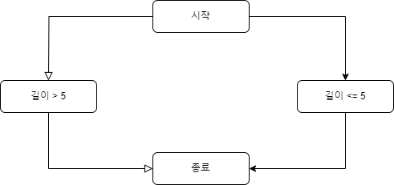
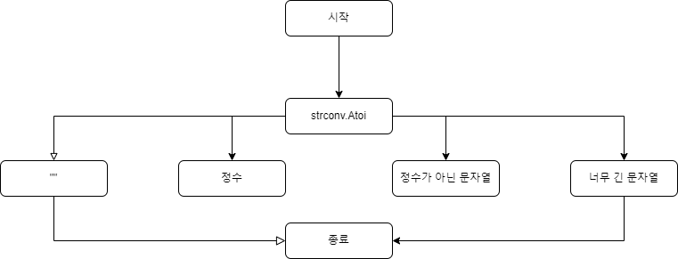

단위 테스트는 단순히 테스트를 작성하는 것 이상이다. 테스트에 드는 노력을 가능한 한 줄이고 그에 따르는 이득을 최대화해야 한다. 이러한 균형을 달성한 프로젝트는 무난하게 성장하고 유지 보수가 많이 필요하지 않으며 끊임없이 변화하는 고객의 요구에 신속히 대응할 수 있는 프로젝트다. 
테스트에 대한 비용 편익 분석(cost-benefit analysis)방법을 배우고 특정 상황에서 적절한 테스트 기술을 적용한다. 공통적인 안티 패턴(anti-pattern, 처음에는 괜찮은 것 같지만 미래에 문제를 야기하는 패턴)을 피하는 방법도 배운다. 
# 단위 테스트 현황
단위 테스트를 작성해야 하는지는 더 이상 논쟁 거리가 아니다. 이제는 `좋은 단위 테스트를 작성 하는 것은 어떤 의미인가`로 논쟁이 바뀌었다. 하지만 이는 여전히 혼란스럽다.
많은 프로젝트에 자동화된 테스트가 있다. 그러나 테스트가 있어도 개발자들이 원하는 결과를 얻지 못하는 경우가 많다. 좋지 않은 테스트는 프로젝트의 상황을 더 나쁘게 할 수 있다. 좋은 테스트와 나쁜 테스트의 차이는 취향이나 개인적인 선호도의 문제가 아니라 프로젝트의 성패를 가르는 문제이다. 
# 단위 테스트의 목표
흔히 단위 테스트 활동이 더 나은 설계로 이어진다고 한다. 하지만 이는 단위 테스트의 주목표는 아니다. 단위 테스트의 주 목표는 소프트웨어 프로젝트의 지속 가능한 성장을 가능하게 하는 것이다. 테스트가 없다면 처음엔 테스트를 작성할 필요가 없기 때문에 개발 속도가 빠르다. 아직 잘못된 아키텍처 결정이 없고 걱정할 만한 코드가 있지도 않기 때문이다. 하지만 시간이 지나면 점점 더 많은 시간을 들여야 처음과 같은 진척도를 낼 수 있다. 결국 개발 속도가 현저히 느려진다.
개발 속도가 빠르게 감소하는 이러한 현상을 소프트웨어 엔트로피라고도 한다. 소프트웨어에서 엔트로피는 품질을 떨어뜨리는 코드 형태로 나타난다. 코드베이스에서 무언가를 변경할 때마다 엔트로피는 증가한다. 지속적인 정리와 리팩토링 등과 같은 적절한 관리를 하지 않고 방치하면 시스템이 점점 더 복잡해지고 무질서해진다. 
테스트로 이러한 경향을 뒤집을 수 있다. 대부분의 버그에 대한 보험을 제공하는 도구라 할 수 있다. 테스트는 새로운 기능을 도입하거나 새로운 요구 사항에 더 잘 맞게 리팩토링 한 후에도 기존 기능이 잘 작동하는지 확인하는 데 도움이 된다.
지속성과 확정성이 핵심이며, 이를 통해 장기적으로 개발 속도를 유지할 수 있다.
## 좋은 테스트와 좋지 않은 테스트를 가르는 요인
좋지 않은 테스트는 결국은 테스트를 작성하지 않은 것과 같이 나쁜 결과를 낳게 된다. 모든 테스트를 작성할 필요는 없다. 일부 테스트는 소프트웨어 품질에 많은 기여를 하지만 그 밖에 다른 테스트는 그렇지 않다. 잘못된 경고가 발생하고, 버그를 알아내는 데 도움이 되지 않으며, 유지 보수가 어렵고 느리다. 프로젝트에 도움이 되는지 여부를 명확하게 파악하지 않고 단위 테스트를 작성하는 데만 빠져들기 쉽다.
테스트의 가치와 유지 비용을 모두 고려해야 한다. 비용 요소는 다양한 활동에 필요한 시간에 따라 결정된다.
- 기반 코드를 리팩토링할 때 테스트도 리팩토링하라.
- 각 코드 변경 시 테스트를 실행하라.
- 테스트가 잘못된 경고를 발생시킬 경우 처리하라.
- 기반 코드가 어떻게 동작하는지 이해하려고 할 때는 테스트를 읽는 데 시간을 투자하라.
지속 가능한 프로젝트 성장을 위해서는 고품질 테스트에만 집중해야 한다.
# 테스트 스위트 품질 측정을 위한 커버리지 지표
>커버리지 지표는 테스트 스위트가 소스 코드를 얼마나 실행하는 지를 백분율로 나타낸다.

커버리지 지표는 테스트 스위트의 품질을 평가하는데 자주 사용된다. 일반적으로 커버리지 숫자가 높을수록 더 좋다. 하지만 이것이 테스트 스위트 품질을 효과적으로 측정하는 데 사용될 수 없다. 
코드 커버리지가 너무 적을 때는 테스트가 충분치 않다는 좋은 증거다. 그러나 100% 커버리지라고 해서 반드시 양질의 테스트 스위트라고 보장하지는 않는다.
## 코드 커버리지 지표에 대한 이해

$$ 코드\,커버리지(테스트 커버리지) = {제품\,코드\,라인\,수 \over 전체\,라인\,수} $$

가장 많이 사용되는 커버리지 지표로 코드 커버리지(code coverage) 가 있으며, 하나 이상의 테스트로 실행된 코드 라인 수와 제품 코드베이스의 전체 라인 수의 비율을 나타낸다.
예제를 통해 어떻게 작동하는지 이해해보자. 예제에서는 `IsStringLong` 함수와 이를 다루는 테스트가 있다. 함수는 입력 매개변수로 제공된 문자열의 길이가 5보다 큰지 판별한다. 테스트는 `"abc"` 를 사용해 함수를 점검하고 이 문자열이 길지 않다고 판별하는지 확인한다.
```go
func IsStringLong(input string) bool {
	if len(input) > 5 {
		return true
	}
	return false
}

func TestIsStringLong(t *testing.T) {
	var actual bool = IsStringLong("abc")
	assert.Equal(t, false, actual)
}
```
여기서 함수 전체 라인 수는 3이다. (아래 중괄호 직전 까지) 그리고 테스트가 실행하는 라인 수는 2이다. 테스트는 `true` 를 반환하는 구문을 제외한 모든 코드 라인을 통과한다 따라서 코드 커버리지는 2/3 = 0.6667 = 66.67% 이다.
이제 함수를 리팩터링하고 불필요한 if 문을 한 줄로 처리하면 다음과 같다.
```go
func IsStringLong(input string) bool {
	return len(input) > 5
}

func TestIsStringLong(t *testing.T) {
	var actual bool = IsStringLong("abc")
	assert.Equal(t, false, actual)
}
```
테스트는 이제 코드 한 줄을 모두 점검하기 때문에 코드 커버리지가 100%로 증가한다. 하지만 리팩터링으로 테스트 스위트를 개선한 것은 아니다. 이 테스트가 검증하는 결과 개수는 여전히 같다.
이 간단한 예제로 커버리지 숫자가 테스트가 좋은 지를 알려주는 명확한 지표가 아님을 확인할 수 있다. 코드가 작을 수록 테스트 커버리지 지표는 더 좋아지는데, 이는 원래 라인 수만 처리하기 때문이다. 
## 분기 커버리지 지표에 대한 이해
분기 커버리지(branch coverage)는 코드 커버리지의 단점을 극복하는 데 도움이 된다. 분기 커버리지 지표는 원시 코드 라인 수를 사용하는 대신 `if`문과 `switch` 문과 같은 제어 구조에 중점을 둔다.
$$ 분기\,커버리지={통과\,분기 \over 전체\,분기\,수}$$
분기 커버리지 지표를 계산하려면 코드베이스에서 모든 가능한 분기를 합산하고 그 중 테스트가 얼마나 많이 실행되는지 확인해야 한다.

```go
func IsStringLong(input string) bool {
	return len(input) > 5
}

func TestIsStringLong(t *testing.T) {
	var actual bool = IsStringLong("abc")
	assert.Equal(t, false, actual)
}
```
이 경우 두 개의 분기가 있는데, 테스트는 하나에 대해서만 적용되므로 분기 커버리지 지표는 1/2 = 0.5 = 50% 이다. 분기 커버리지는 분기 개수만 다루며, 해당 분기를 구현하는 데 얼마나 코드가 필요한지 고려하지 않는다. 
그래프를 이용하면 분기 커버리지 지표를 시각화 하는데 유용하다. 테스트 코드가 취할 수 있는 가능한 경로를 모두 표시하고 그 중 얼마나 통과했는지를 확인한다.



## 커버리지 지표에 관한 문제점
분기 커버리지로 코드 커버리지 보다 더 나은 결과를 얻을 수 있지만, 테스트 스위트의 품질을 결정하는 데 어떤 커버리지 지표도 의존할 수 없는 이유는 다음과 같다.
- 테스트 대상 시스템의 모든 가능한 결과를 검증한다고 보장할 수 없다.
- 외부 라이브러리의 코드 경로를 고려할 수 있는 커버리지 지표는 없다.
### 가능한 모든 결과를 검증한다고 보증할 수 없음
단지 코드 경로를 통과하는 것이 아니라 실제로 테스트하려면, 단위 테스트에는 반드시 적절한 검증이 있어야 한다. 테스트 대상 시스템이 낸 결과가 정확히 예상하는 결과인지 확인해야 한다. 게다가 결과가 여러 개 있을 수 있다. 따라서 커버리지 지표가 의미가 있으려면, 모든 측정 지표를 검증해야 한다.
다음 예제는 `IsStringLong` 의 다른 버전을 보여준다. 

```go
var WasLastStringLong bool

func IsStringLong(input string) bool {
	result := len(input) > 5
	WasLastStringLong = result
	return result
}

func TestIsStringLong(t *testing.T) {
	var actual bool = IsStringLong("abc")
	assert.Equal(t, false, actual)
}
```

`IsStringLong` 함수에는 이제 값을 반환하는 명시적인 결과와 변수에 새로운 값을 쓰는 암묵적인 결과가 있다. 그리고 암묵적인 결과를 검증하지 않더라도 커버리지 지표는 100% 코드 커버리지와 50% 분기 커버리지의 동일한 결과를 보여준다. 보다시피 커버리지 지표는 기반 코드를 테스트했다고 보장할 수 없으며 일부 실행된 것만 보장한다.
더 극단적인 상황은 검증이 전혀 없는 테스트의 경우다.
```go
func TestNoValidation(t *testing.T) {
	IsStringLong("abc")
	IsStringLong("abcdef")
}
```
이 경우 코드 커버리지와 분기 커버리지 모두 100%를 나타낸다. 그러나 아무것도 검증하지 않았기 때문에 전혀 쓸모 없다.
하지만 테스트 대상 코드에 대해 각각의 결과를 철저히 검증한다고 해도 커버리지 지표를 테스트 스위트 품질을 결정하는 데 사용할 수 없다.
### 외부 라이브러리의 코드 경로를 고려할 수 없음
모든 커버리지 지표가 테스트 대상 시스템이 메서드를 호출할 때 외부 라이브러리가 통과하는 코드 경로를 고려하지 않는다는 것이다.
```go
func Parse(input string) int {
	rst, _ := strconv.Atoi(input)
	return rst
}

func TestPars(t *testing.T) {
	actual := Parse("5")
	assert.Equal(t, 5, actual)
}
```
분기 커버리지 지표는 100%이며, 테스트는 메서드 결과의 모든 구성요소를 검증한다. 하지만 이 테스트는 완벽하지 않다. `strconv.Atoi` 가 수행하는 코드 경로는 고려하지 않는다. 



입력 매개변수를 변경하면 다른 결과로 이어질 수 있고 테스트로부터 숨어있는 분기가 많다. 매개변수가 빈 문자열이거나, 정수로 변환할 수 없는 문자열이거나, 너무 긴 문자열인 경우에는 정수로 변환할 수 없다. 
수 많은 예외 상황에 빠질 수 있지만, 테스트에서 모든 예외 상황을 다루는지 확인할 방법이 없다. 
이는 커버리지 지표가 외부 라이브러리의 코드 경로를 고려해야 한다는 것이 아니라, 해당 지표로는 단위 테스트가 얼마나 좋은지 나쁜지를 판단할 수 없다는 것을 보여준다. 커버리지 지표로 테스트가 철저한지 또는 테스트가 충분한지 알 수는 없다.
## 특정 커버리지 숫자를 목표로 하기
지금까지의 내용으로 테스트 스위트 품질을 결정하기에 커버리지 지표로는 충분치 않다는 것을 알 수 있다. 커버리지 지표는 지표 그 자체로 보는 것이지, 목표로 여겨서는 안된다.
병원의 환자를 생각해보자. 체온이 높으면 열이 난다는 것을 의미할 수 있다. 그러나 병원은 환자의 적절한 체온을 목표로 해서는 안된다. 단순히 목표가 되면, 환자 옆에 에어컨을 설치해서 '효율적으로' 빨리 끝낼 수도 있다. 물론 이런 접근은 의미가 없다.
마찬가지로 특정 커버리지 숫자를 목표로 하는 것은 단위 테스트의 목표와 반대되는 그릇된 동기 부여가 된다. 테스트하는 데 집중하는 대신 인공적인 목표를 달성하기 위한 방법을 찾기 시작한다. 커버리지 숫자를 강요하면 테스트 대상에 신경 쓰지 못하고, 결국 적절한 단위 테스트는 더욱 달성하기 어려워진다.
커버리지 지표는 좋은 부정 지표지만 나쁜 긍정 지표다. 커버리지 숫자가 낮으면 문제 징후라 할 수 있다. 테스트 되지 않은 코드가 많다는 뜻이기 때문이다. 그러나 높은 숫자도 별 의미는 없다. 코드 커버리지를 측정하는 것은 좋은 테스트 스위트로 가는 첫걸음일 뿐이다.
# 무엇이 성공적인 테스트 스위트를 만드는가?
믿을 만한 방법은 스위트 내 각 테스트를 하나씩 따로 평가하는 것 뿐이다. 물론 한 번에 모든 것을 평가할 필요는 없다. 이에 앞서 노력을 상당이 들여야할 수도 있다. 요점은 테스트 스위트가 얼마나 좋은지 자동으로 확인할 수 없다는 것이다. 개인 판단에 맡겨야 한다.
성공적인 테스트 스위트는 다음과 같은 특성을 갖고 있다.
- 개발 주기에 통합돼 있다.
- 코드베이스에서 가장 중요한 부분만을 대상으로 한다.
- 최소한의 유지비로 최대의 가치를 끌어낸다.
## 개발 주기에 통합돼 있음
모든 테스트는 개발 주기에 통합돼야 한다. 이상적으로는 코드가 변경될 때마다 아무리 작은 것이라도 실행해야 한다. 
## 코드베이스에서 가장 중요한 부분만을 대상으로 함
단위 테스트 측면에서 코드 베이스의 모든 부분에 똑같이 주목할 필요는 없다. 시스템의 가장 중요한 부분에 단위 테스트 노력을 기울이고, 다른 부분은 간략하게 또는 간접적으로 검증하는 것이 좋다. 대부분의 애플리케이션에서 가장 중요한 부분은 비즈니스 로직이 있는 부분이다. 비즈니스 로직 테스트가 시간 투자 대비 최고의 수익을 낼 수 있다.
다른 모든 부분은 세 가지 범주로 나눌 수 있다.
- 인프라 코드
- 데이터베이스나 서드파티 시스템과 같은 외부 서비스 및 종속성
- 모든 것을 하나로 묶는 코드
이 중 일부는 단위 테스트를 철저히 해야 할 수 있다. 
통합 테스트와 같이 일부 테스트는 도메인 모델을 넘어 코드 베이스의 중요하지 않은 부분을 포함해 시스템이 전체적으로 어떻게 작동하는지 확인할 수 있다. 그러나 초점은 도메인 모델에 머물러 있어야 한다.
이 지침을 따르려면 도메인 모델을 코드 베이스 중 중요하지 않은 부분과 분리해야 한다. 2부에서 자세히 다룬다.
## 최소 유지비로 최대 가치를 끌어냄
단위 테스트에서 가장 어려운 부분은 최소 유지비로 최대 가치를 달성하는 것이다. 이는 이 책에서 말하려는 핵심이다.
위의 두 특성들 만으로는 충분하지 않다. 가치가 유지비를 상회하는 테스트만 스위트에 유지하는 것이 중요하다.
이 마지막 특성은 두 가지로 나눌 수 있다.
- 가치 있는 테스트 식별하기
- 가치 있는 테스트 작성하기
가치가 높은 테스트를 식별하려면 기준틀이 필요하다. 가치 있는 테스트를 작성하려면 코드 설계 기술도 알아야한다. 단위 테스트와 기반 코드는 서로 얽혀 있으므로 코드베이스에 노력을 많이 기울이지 않으면 가치 있는 테스트를 만들 수 없다.
새로운 테스트를 작성하는 것은 기존 테스트를 시험하는 것 보다 더 많은 노력이 드는데, 대부분 아무것도 없는 상태에서 테스트를 작성하지 않고 기반 코드를 고려해야 하기 때문이다. 따라서 단위 테스트에 중점을 뒀지만, 이 책의 상당 부분은 코드 설계에 할애하고 있다.
# 이 책을 통해 배우는 것
이 책을 통해 테스트 스위트 내 모든 테스트를 분석하는 데 사용할 수 있는 기준틀을 설명한다. 기준틀이 기초다. 그러고 나서 새로운 관점에서 많은 테스트를 볼 수 있으며, 어떤 것이 프로젝트에 기여하고 어떤 것을 리팩토링해야 하거나 완전히 제거해야 하는지 알 수 있을 것이다.