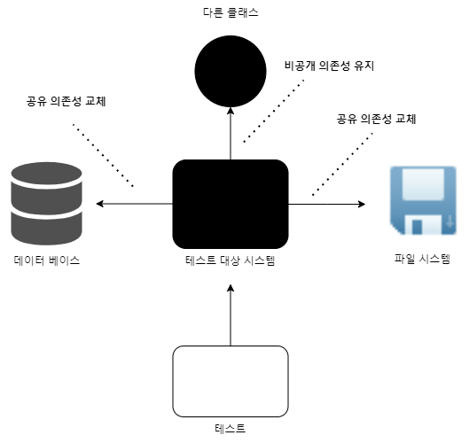

단위 테스트에 접근하는 방법은 두 가지 뚜렷한 견해로 나뉘었다. 각각 고전파(classic school)와 런던파(london school)로 알려져 있다. 고전파는 모든 사람이 단위 테스트와 테스트 주도 개발에 원론적으로 접근하는 방식이기 때문에 고전이라고 한다. 런던파는 런던의 프로그래밍 커뮤니티에서 시작 됐다. 고전적 스타일과 런던 스타일의 차이는 5장의 토대가 되고, 5장에서는 목과 테스트 취약성을 다룬다.
# 단위 테스트의 정의
중요하지 않은 것들을 제외하면 다음과 같이 가장 중요한 세 가지 속성이 있다.
단위 테스트는 
- 작은 코드 조각(단위)을 검증하고,
- 빠르게 수행하고,
- 격리된 방식으로 처리하는 자동화된 테스트다.
대중의 의견이 크게 다른 것은 세 번째 속성이다. 격리 문제는 단위 테스트의 고전파와 런던파를 구분하는 근원적 차이이다. 두 분파 간의 모든 차이는 격리가 정확히 무엇인지에 대한 의견 차이 하나로 자연스럽게 시작됐다.
## 격리 문제에 대한 런던파의 접근
런던파에서는 테스트 대상 시스템을 협력자(collaborator)에게서 격리하는 것을 일컫는다. 하나의 클래스가 다른 클래스 또는 여러 클래스에 의존하면 이 모든 의존성을 태스트 대역(test double)으로 대체해야 한다. 이런 식으로 동작을 외부 영향과 분리해서 테스트 대상 클래스에만 집중할 수 있다.


위의 그림은 일반적으로 격리가 어떻게 이뤄지는지 보여준다. 의존성이 포함된 테스트 대상 시스템을 검증하는 단위 테스트는 이제 해당 의존성과 별개로 수행할 수 있다.
이 방법의 한 가지 이점은 코드 베이스의 어느 부분이 고장 났는지 확실히 알 수 있다는 점이다. 테스트의 모든 의존성은 테스트 대역으로 대체됐기 때문에 대상 시스템이 고장 난 것이다.
또 다른 이점은 객체 그래프(같은 문제를 해결하는 클래스의 통신망)를 분할할 수 있다는 것이다. 모든 클래스가 각각 의존성을 갖고 있으며 또 그 의존성이 다른 의존성을 갖고 있는 식으로 그래프가 복잡해 질 수 있다.
의존성을 가진 코드베이스를 테스트하는 것은 테스트 대역 없이는 어렵다. 유일하게 남은 선택은 전체 객체 그래프를 다시 만드는 것이다.(테스트를 하려면 실제 제품에 해당하는 의존성 외에 테스트 목적의 의존성들로 구성해서 대체해야 하는데, 직접 참조하는 의존성을 테스트 목적의 의존성으로 대체하고 해당 의존성들을 다시 테스트 목적의 의존성을 참조하는 식으로 모두 대체하게 되면 결국 이 작업은 객체 그래프를 다시 만든다고 할 수 있다.)
테스트 대역을 사용하면 클래스의 직접적인 의존성을 대체할 수 있고 더 나아가 의존성의 의존성을 다룰 필요도 없다. 그래프를 효과적으로 분해해 단위 테스트에서 준비를 크게 줄일 수 있다.
단위 테스트 격리의 또 다른 이점이 있다. 프로젝트 전반적으로 한 번에 한 클래스만 테스트하라는 지침을 도입하면 전체 단위 테스트 스위트를 간단한 구조로 할 수 있다. 클래스가 있다면 클래스에 해당하는 단위 테스트 클래스를 생성하면 된다.

다음 예시에서는 고전적인 스타일로 작성된 샘플 테스트를 살펴본 후 런던 방식을 사용해 다시 작성해본다.
온라인 상점을 운영한다고 가정하자. 샘플 애플리케이션에는 고객이 제품을 구매할 수 있다는 간단한 유스케이스가 하나 있다. 상점에 재고가 충분하면 구매는 성공, 구매 수량만큼 상점의 제품 수량이 줄어든다. 제품이 충분하지 않으면 구매는 성공하지 못하며 상점에 아무 일도 일어나지 않는다.
예제 2.1에는 상점에 재고가 충분히 있을 때만 구매가 성공하는지 검증하는 두 가지 테스트가 있다. 고전적 스타일로 작성됐으며 일반적인 3단 구성인 준비, 실행, 검증 패턴을 사용한다.(AAA, Arrange, Act, Assert)

```go
func TestPurchaseSucceedsWhenEnoughInventory(t *testing.T) {
	// Arrange
	var s Store = NewStore()
	s.AddInventory(Shampoo, 10)
	var c Customer = NewCustomer()

	// Act
	var success bool = c.Purchase(s, Shampoo, 5)
	
	// Assert
	assert.True(t, success)
	assert.Equal(t, 5, s.GetInventory(Shampoo))
}

func TestPurchaseFailsWhenNotEnoughInventory(t *testing.T) {
	// Arrange
	var s Store = NewStore()
	s.AddInventory(Shampoo, 10)
	var c Customer = NewCustomer()

	// Act
	var success bool = c.Purchase(s, Shampoo, 15)

	// Assert
	assert.False(t, success)
	assert.Equal(t, 10, s.GetInventory(Shampoo))
}
```

준비 부분은 의존성과 테스트 대상 시스템을 모두 준비하는 부분이다. `c.Purchase()` 호출은 실행 단계이며 검증하고자 하는 동작을 수행한다. 검증 단계는 동작이 예상 결과로 이어지는지 확인한다.
준비 단계에서는 테스트 대상 시스템(SUT, System Under Test) 과 하나의 협력자를 준비한다. 이 경우 고객이 SUT에 상점이 협력자에 해당한다. 다음 두 가지 이유로 협력자가 필요하다.
- 테스트 대상 메서드를 컴파일하려면 `c.Purchase()` 가 `Store` 인수를 필요로 하기 때문에
- 검증 단계에서 `customer.Purchase()` 의 결과 중 하나로 상점 제품 수량이 감소할 가능성이 있기 때문에

이 코드는 단위 테스트의 고전 스타일 예로, 테스트는 협력자를 대체하지 않고 운영용 인스턴스를 사용한다. 고전적인 방식의 자연스러운 결과로 `Customer`와 `Store` 둘 다 효과적으로 검증한다. 그러나 `Customer`가 올바르게 작동하더라도 `Store` 내부에 버그가 있다면 단위 테스트에 실패할 수 있다. 테스트에서 두 클래스는 서로 격리돼 있지 않다.
런던 스타일로 예제를 수정해본다. 동일한 테스트에서 `Store` 인스턴스는 테스트 대역, 구체적으로 목으로 교체한다.

>목은 테스트 대상 시스템과 협력자 간의 상호 작용을 검사할 수 있는 특별한 테스트 대역이다.

목은 테스트 대역의 부분집합이다. 흔히 테스트 대역과 목을 동의어로 사용하지만, 기술적으로는 그렇지 않다.
- 테스트 대역은 실행과 관련 없이 모든 종류의 가짜 의존성을 설명하는 포괄적인 용어다.
- 목은 그러한 의존성의 한 종류일 뿐이다.
다음 예제에서는 `Customer`가  협력자인 `Store` 에서 격리된 후 어떻게 테스트가 수행되는지 보여준다. 이 예제를 해결하기 위해서 `testify/mock` 패키지를 사용했으며 mock을 자동 생성하기 위해서 `mockery` 를 사용했다. 

```go
func TestPurchaseSucceedsWhenEnoughInventory(t *testing.T) {
	// Arrange
	var mockStore *MockIStore = NewMockIStore(t)
	mockStore.On("HasEnoughInventory", Shampoo, 5).Return(true).Once()
	mockStore.On("RemoveInventory", Shampoo, 5).Return(nil).Maybe()
	var customer Customer = NewCustomer()

	// Act
	var success bool = customer.Purchase(mockStore, Shampoo, 5)
	// Assert
	assert.True(t, success)
	mockStore.AssertCalled(t, "RemoveInventory", Shampoo, 5)
}

func TestPurchaseFailsWhenNotEnoughInventory(t *testing.T) {
	// Arrange
	var mockStore *MockIStore = NewMockIStore(t)
	mockStore.On("HasEnoughInventory", Shampoo, 5).Return(false).Once()
	mockStore.On("RemoveInventory", Shampoo, 5).Return(nil).Maybe()
	var customer Customer = NewCustomer()

	// Act
	var success bool = customer.Purchase(mockStore, Shampoo, 5)

	// Assert
	assert.False(t, success)
	mockStore.AssertNotCalled(t, "RemoveInventory", Shampoo, 5)
}
```
고전 스타일로 작성된 테스트와 다른 점을 살펴보자. 준비 단계에서 테스트는 `Store`의 실제 인스턴스를 생성하지 않고 `mock.Mock` 을 필드로 갖고 `Store` 인터페이스를 구현하는 `MockIStore` 구조체로 대체한다.
또한 샴푸 재고를 추가해 `Store` 상태를 수정하는 대신 `HasEnoughInventory()` 메서드 호출에 어떻게 응답하는지 목에 직접 정의한다. `Store`의 실제 상태와 관계없이 테스트가 요구하는 방식으로 요청에 응답한다. 테스트는 더 이상 `Store`를 사용하지 않는다.
협력자에서 격리된 테스트 대상 시스템에는 인터페이스가 필요하다.(8장에서 다시 한다.)
검증 단계도 바뀌었다. 여전히 `customer.Purchase` 결과를 확인하지만, 확인하는 방법이 다르다. 이전에는 상점 상태를 검증했다. 지금은 `Customer` 와 `Store` 간의 상호 작용을 검사한다. 즉, 고객이 상점에서 호출을 올바르게 했는지 확인한다. 고객이 상점으로 호출해야 하는 메서드 뿐만 아니라 호출 횟수까지 검증할 수 있다. 
### 격리 문제에 대한 고전파의 접근
런던 스타일은 테스트 대역(목)으로 테스트 대상 코드 조각을 분리해서 격리 요구 사항에 다가간다. 이 관점은 무엇이 작은 코드 조각(단위)에 해당하는지에 대한 견해에도 영향을 미친다. 단위 테스트의 속성을 다시 한 번 살펴보자.
- 단위 테스트는 작은 코드 조각(단위)을 검증한다.
- 신속하게 수행하고,
- 격리된 방식으로 진행한다.
첫 번째 속성에도 다양한 해석이 가능하다. 이전 절에서 처럼, 각각의 모든 클래스를 격리해야 한다면 테스트 대상 코드 조각은 당연히 단일 클래스이거나 해당 클래스 내의 메서드여야 한다. 한 번에 몇 개의 클래스를 테스트할 수도 있기는 하지만 일반적으로 한 번에 한 클래스로 테스트하는 지침을 따르려고 노력해야한다.
고전적인 방법에서 코드를 꼭 격리하는 방식으로 테스트해야 하는 것은 아니다. 대신 단위 테스트는 서로 격리해서 실행해야 한다. 이렇게 하면 테스트를 어떤 순서로든 가장 적합한 방식으로 실행할 수 있으며 서로의 결과에 영향을 미치지 않는다. 
각각의 테스트를 격리하는 것은 여러 클래스가 모두 메모리에 상주하고 공유 상태에 도달하지 않는 한, 여러 클래스를 한 번에 테스트해도 괜찮다는 뜻이다. 이를 통해 테스트가 서로 소통하고 실행 컨텍스트에 영향을 줄 수도 있다.
테스트 대역을 사용할 수 있지만, 보통 테스트 간에 공유 상태를 일으키는 의존성에 대해서만 사용한다.


공유 의존성은 테스트 대상 클래스(단위) 간이 아니라 단위 테스트 간에 공유한다. 그런 의미에서 싱글턴(singleton) 의존성은 각 테스트에서 새 인스턴스를 만들 수 있기만 하면 공유 되지 않는다. 제품 코드에는 싱글턴 인스턴스가 단 하나만 있지만, 테스트는 이 패턴을 따르지 않고 재사용하지도 않는다. 따라서 이러한 의존성은 비공개인 것이다.
예를 들어 설정 클래스(configuration class) 는 일반적으로 한 개뿐이며, 모든 제품 코드에서 이 인스턴스를 재사용한다. 그러나 생성자 등을 통해 다른 모든 의존성이 SUT에 주입되면 각 테스트에서 새 인스턴스를 만들 수 있다. 테스트 스위트 전체에서 단일 인스턴스를 유지할 필요는 없다. 그러나 새 파일 시스템이나 데이터베이스를 만들 수는 없으며, 테스트 간에 공유되거나 테스트 대역으로 대체돼야 한다.
공유 의존성을 대체하는 또 다른 이유는 테스트 실행 속도를 높이는 데 있다. 공유 의존성은 거의 항상 실행 프로세스 외부에 있는데 반해, 비공개 의존성은 보통 그 경계를 넘지 않는다. (DB, 파일시스템등의 호출) 단위 테스트는 빨리 실행해야 하는 필요성이 있으므로, 이러한 호출을 포함하는 공유 의존성을 가진 테스트는 통합 테스트 영역으로 넘어간다.
이러한 격리에 대한 대안적 견해는 또한 딘위를 구성하는 것에 대한 다른 견해로 이어진다. 단위가 반드시 클래스에 국한될 필요는 없다. 공유 의존성이 없는 한 여러 클래스를 묶어서 단위 테스트 할 수도 있다.