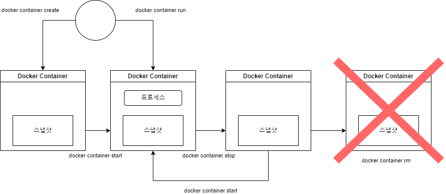

도커 이미지를 레지스트리에서 다운로드/업로드 하거나 도커 컨테이너의 시작이나 정지를 하는 조작은 모두 docker 명령으로 수행한다. 따라서 명령 조작에 익숙해질 필요가 있다. 
# Docker 이미지 조작
도커 레지스트리에서 특정 레포지토리에 접근할 수 있다. 이미지의 경우 `이미지명:태그명` 의 형태로 접근한다. 
## 이미지 다운로드 `docker image pull`
```
docker image pull [옵션] 이미지명[:태그명]
```
- 태그명을 생락하면 latest를 취득한다. 
- `-a` 옵션을 주면 모든 태그 이미지를 취득한다. 
- 이미지 명에 이미지를 취득할 URL을 지정할 수도 있다. URL은 프로토콜을 제외하고 지정한다.
```
docker image pull gcr.io.tensorflow/tensorflow
```

## 이미지 목록 표시 `docker image ls`
취득한 이미지의 목록을 표시하기 위한 명령이다.
```
docker image ls [옵션] [리포지토리명]
```
- `-a` 옵션을 지정하면 중간 이미지도 모두 표시된다. 
- 레지스트리에 업로드한 이미지는 이미지를 고유하게 식별하기 위한 다이제스트가 부여된다. 다이제스트를 표시하고 싶을 때는 `--digest` 옵션을 설정한다.

## 이미지 상세 정보 확인 `docker image inspect`
```
docker image inspect 이미지이름
```
- 명령을 실행하면 결과는 JSON 형식으로 표시된다. 
- 특정 값을 취하고 싶을 때는 `--format` 옵션에서 JSON 형식 데이터의 계층 구조를 지정한다. 
```
[root@docker ~]# docker image inspect --format "{{ .Config.Cmd}}" centos:7
[/bin/bash]
[root@docker ~]# docker image inspect --format "{{ .Os}}" centos:7
linux

```

## 이미지 태그 설정 `docker image tag`
이미지에 표식이 되는 태그를 붙이려면 docker image tag 명령을 사용한다. 이미지 태그에는 식별하기 쉬운 버전명을 붙이는 것이 일반적이다. Docker Hub에 작성한 이미지를 등록하려면 다음과 같은 규칙으로 이미지에 사용자명을 붙여야한다.
```
<Docker Hub사용자명>/이미지명:태그명
```

```
[root@docker ~]# docker image ls
REPOSITORY   TAG       IMAGE ID       CREATED         SIZE
httpd        latest    81a1863c7bda   2 days ago      145MB
centos       7         eeb6ee3f44bd   16 months ago   204MB
[root@docker ~]# docker image ls
REPOSITORY   TAG       IMAGE ID       CREATED         SIZE
httpd        latest    81a1863c7bda   2 days ago      145MB
hajong/os    1.0       eeb6ee3f44bd   16 months ago   204MB
centos       7         eeb6ee3f44bd   16 months ago   204MB
[root@docker ~]# docker system  df
TYPE            TOTAL     ACTIVE    SIZE      RECLAIMABLE
Images          2         1         349MB     145.1MB (41%)
Containers      1         1         38B       0B (0%)
Local Volumes   0         0         0B        0B
Build Cache     0         0         0B        0B

```

- 이미지의 ID가 동일한 것을 확이날 수 있다. 이미지에 별명을 붙일 뿐 이미지 자체를 복사하거나 이름을 바꾼 것이 아니다. 

## 이미지 검색 `docker search`
Docker Hub에 공개되어 있는 이미지를 검색할 때 사용한다. 
```
docker search [옵션] <검색 키워드>
```
- `--filter=start=n` 으로 stars 수가 높은 이미지를 찾을 수 있다.
```
[root@docker ~]# docker search --filter=stars=1000 nginx
NAME      DESCRIPTION                STARS     OFFICIAL   AUTOMATED
nginx     Official build of Nginx.   18031     [OK] 
```
- 도커 허브에 있는 이미지가 모두 안전하지는 않으므로 공식 이미지가 Dockerfile이 제대로 공개되어 있는 것을 선택하여 확인해야한다. 

## 이미지 삭제 docker image rm
```
docker image rm [옵션] 이미지명 [이미지명]
```
- 이미지 명은 REPOSITORY 또는 IMAGE ID 를 지정한다. 
- 명령의 인수로 컨테이너의 IMAGE ID 를 지정할 수도 있다
- `-f` 옵션으로 강제로 삭제할 수 있다. 

사용하지 않은 도커 이미지의 경우 docker image prune 명령을 사용한다. 
```
docker image prune [옵션]
```
- `-a` 옵션으로 사용하지 않은 이미지를 모두 삭제할 수 있다. 
- `-f` 옵션으로 강제로 삭제할 수 있다.

## Docker Hub에 로그인 `docker login`
```
docker login [옵션] [서버]
```
- 옵션을 지정하지 않으면 사용자명과 비밀번호를 물어본다. 서버명을 지정하지 않았을 때는 Docker Hub에 액세스 된다.
- `-p`, `-u` 옵션으로 비밀번호와 사용자명을 지정해서 넘겨줘도 된다. 

## 이미지 업로드 `docker image push`
```
docker image push 이미지명[:태그명]
```
- 이미지 이름은 `<Docker Hub 사용자명>/이미지명[:태그명]` 의 형태로 정해 둘 필요가 있다.
- 사전에 계정을 만들고 로그인 해둘 필요가 있다. 

## Docker Hub 에서 로그아웃 `docker logout`
```
docker logout [서버명]
```

# Docker 컨테이너 생성/시작/정지

## 컨테이너 라이프 사이클



### 컨테이너 생성 `docker container create`
이미지로 부터 컨테이너를 생성한다. 이미지의 실체는 도커에서 서버 기능을 작동시키기 위해 필요한 디렉토리 및 파일들, 구체적으로는 리눅스의 작동에 필요한 `/etc` 나 `/bin`등과 같은 디렉토리 및 파일들이다. 
명령을 실행하면 이미지에 포함될 리눅스의 디렉토리와 파일들의 스냅샷을 취한다. 스냅샷이란 스토리지 안에 존재하는 파일과 디렉토리를 특정 타이밍에서 추출한 것을 마라한ㄷ. 
### 컨테이너 생성 및 시작 `docker container run`
이미지로부터 컨테이너를 생성하고, 컨테이너 상에서 임의의 프로세스를 시작한다. 
### 컨테이너 시작 `docker container start`
정지중인 컨테이너를 시작한다.
### 컨테이너 정지 `docker container stop`
실행 중인 컨테이너를 정지시킬 때 사용한다. 컨테이너를 재시작하고 싶을 때는 `docker container restart` 명령을 실행한다.
### 컨테이너 삭제 `docker container rm`
컨테이너를 삭제할 때 사용한다. 정지중인 컨테이너 프로세스를 삭제한다. 

## `docker container run`

```
docker container run [옵션] 이미지명[:태그명] 인수
```

- 주요 옵션
| 옵션                                                                      | 설명                                          |
| ------------------------------------------------------------------------- | --------------------------------------------- |
| --attach, -a                                                              | 표준 입력, 표준 출력, 표준 에러에 어태치한다. |
| --cidfile                                                                 | 컨테이너 ID를 파일로 출력한다.                |
| --detach, -d                                                              | 컨테이너를 생성하고 백그라운드에서 실행한다.  |
| --interactive, -i                                                         | 컨테이너의 표준 입력을 연다.                  |
| --tty, -y                                                                 | 단말기 디바이스를 사용한다.                   |
| --user, -u                                                                | 사용자명을 지정                               |
| --restart=\[no\| on-failure\| on-failure:n \| allways \| unless-stopped ] | 명령의 실행 결과에 따라 재시작을 하는 옵션    |
| --rm                                                                      | 명령 실행 완료 후에 컨테이너를 자동으로 삭제                                              |

- `-d` 옵션으로 백그라운드에서 실행하게 할 수 있다. 
- 백그라운드에서 실행되고 있느니 확인하려면 `docker container logs` 명령을 사용한다.
	- `-t` 옵션은 타임 스탬프를 표시하는 것이다. 
- on-failure 의 경우 종료 스테이터스가 0이 아닐 때 재시작 하는 옵션이다. 

### 컨테이너의 네트워크 설정
| 옵션                                                                 | 설명                                              |
| -------------------------------------------------------------------- | ------------------------------------------------- |
| --add-host=\[호스트명:IP주소]                                        | 컨테이너의 /etc/hosts에 호스트명과 IP 주소를 정의 |
| --dns=\[IP주소]                                                      | 컨테이너용 DNS 서버의 IP 주소 지정                |
| --expose                                                             | 지정한 범위의 포트를 할당                         |
| --mac-address=\[MAC주소]                                             | 컨테이너의 MAC 주소를 지정                        |
| --net=\[bridge \| none \| container:<name \| id> \| host \| NETWORK] | 컨테이너의 네트워크를 지정                        |
| --hostname, -h                                                       | 컨테이너 자신의 호스트명을 지정                   |
| --publish, -p\[호스트의 포트번호]:\[컨테이너의 포트번호]             | 호스트와 컨테이너의 포트 매핑                     |
| --publish-all, -P                                                    | 호스트의 임의의 포트를 컨테이너에 할당            | 

- 지정한 범위로 포트 번호를 할당하고 싶을 때는 --expose 옵션을 사용하고, 호스트 머신의 임의의 포트를 할당할 때는 -P 옵션을 사용한다. 
- DNS 서버는 IP 주소로 지정한다. 
- Docker에서는 기본적으로 호스트 OS와 브리지 연결을 하지만 `--net` 옵션을 사용하면 다음과 같은 네트워크 설정이 가능하다.
| 설정값                  | 설명                                        |
| ----------------------- | ------------------------------------------- |
| bridge                  | 브리지 연결(기본값)을 사용한다.             |
| none                    | 네트워크에 연결하지 않는다.                 |
| container:\[name \| id] | 다른 컨테이너의 네트워크를 사용한다.        |
| host                    | 컨테이너가 호스트 OS의 네트워크를 사용한다. |
| NETWORK                 | 사용자 정의 네트워크를 사용한다.            | 

사용자 정의 네트워크는 `docker network create` 명령으로 작성한다. 이 네트워크를 작성하려면 Docker 네트워크 드라이버 또는 외부 네트워크 드라이버 플러그인을 사용해야한다. 똑같은 네트워크에 대해 여러 컨테이너가 연결을 할 수 있다. 사용자 정의 네트워크에 연결하면 컨테이너는 컨테이너의 이름이나 IP 주소로 서로 통신을 할 수 있다.
오버레이 네트워크나 커스텀 플러그인을 사용하면 멀티호스트에 대한 연결을 할 수 있다. 컨테이너가 동일한 멀티호스트 네트워크에 연결되어 있으면 이 네트워크를 통해 통신이 가능하다.

### 자원을 지정하여 컨테이너 생성 및 실행
```
docker container run [자원 옵션] 이미지명[:태그명] [인수]
```

| 옵션                                                     | 설명                                                  |
| -------------------------------------------------------- | ----------------------------------------------------- |
| --cpuset-cpus                                            | 컨테이너가 특정 CPU만 사용하도록 지정                 |
| --cpus                                                   | cpu를 최대 몇 % 사용할지 지정                         |
| --cpu-shares, -c                                         | cpu 상대적 가중치 제한                                |
| --memory, -m                                             | 사용할 메모리를 제한하여 실행, 단위는 b,k,m,g 중 하나 |
| --volume=\[호스트의 디렉토리]:\[컨테이너의 디렉토리], -v | 호스트와 컨테이너의 디렉토리를 공유                   |

- stress-ng 를 사용하는 docker image를 사용하여 cpu 사용을 테스트해본다. 
- `--cpuset-cpus` 는 특정 cpu만 사용하도록 지정한다.

docker run -it --cpuset-cpus=0 --name cpustress --rm containerstack/cpustress --cpu 2
워커는 2개이지만 첫 번째 cpu만 사용하도록 지정했다. 


docker run -it --cpuset-cpus=0,3 --name cpustress --rm containerstack/cpustress --cpu 2
워커 2개에 첫 번째와 네 번째 cpu를 사용하도록 지정했다.


docker run -it --cpuset-cpus=0-3 --name cpustress --rm containerstack/cpustress --cpu 3
워커 3개에 모든 cpu를 사용할 수 있도록 했다.


- `--cpus` 는 사용할 cpu의 수를 지정한다. 이는 비율로 지정하게 된다. 그런데 사용하는 cpu가 1개라면 1이 100%가 되고 3개라면 3이 100%가 된다.

docker run -it --cpuset-cpus=0 --cpus=0.5 --name cpustress --rm containerstack/cpustress --cpu 1
사용하는 cpu 한 개에 50%를 지정


docker run -it --cpuset-cpus=0,1 --cpus=1 --name cpustress --rm containerstack/cpustress --cpu 2
사용하는 cpu 2개에 1을 지정 즉 50%를 사용하게 한 것이다.


docker run -it --cpuset-cpus=0-3 --cpus=1 --name cpustress --rm containerstack/cpustress --cpu 4
사용하는 cpu 4개에 1을 지정 증 25%를 사용하도록 했다.


- `--cpu-shares` 는 같은 코어에서 상대적 기준치 제한으로 기본값은 1024이다. 

docker run -d --cpu-shares 512 --name cpustress --rm containerstack/cpustress --cpu 1 --timeout 10s
512로 지정해도 다른 cpu가 동작하지 않기 때문에 100%를 사용하게 된다.


docker run -d --cpuset-cpus=1 --cpu-shares 512 --rm containerstack/cpustress --cpu 1 --timeout 20s
docker run -d --cpuset-cpus=1 --cpu-shares 1024 --rm containerstack/cpustress --cpu 1 --timeout 20s
값을 다르게 지정한 경우 하나는 66%를 다른 하나는 33%를 사용하여 1/2배를 사용하게 된다.


docker run -d --cpuset-cpus=0 --cpu-shares 512 --rm containerstack/cpustress --cpu 1 --timeout 20s
docker run -d --cpuset-cpus=1 --cpu-shares 1024 --rm containerstack/cpustress --cpu 1 --timeout 20s
사용하는 CPU가 다른 경우에는 영향을 주지 않는다. 


