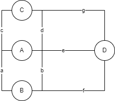

그래프 이론에서 그래프란 객체의 일부 쌍들이 연관되어 있는 객체 집합 구조를 말한다.
오일러가 쾨니히스베르크 다리 문제를 조사하면서 당시까지 알려진 기하학으로는 풀 수 없음을 알아냈고, 미지의 영역에 그 해법이 있다는 것을 직관적으로 간파하였다. 이것이 그래프 이론의 시작이다.
# 오일러 경로
오일러는 7개의 다리에 a부터 g까지의 이름을 부여하고 도식화에 1735년에 논문을 발표했다. 논문에 포함된 스케치는 현대에 이르러 그래프 구조의 원형이 되었다. A~D 는 정점(vertex), a~g는 간선(edge)로 구성된 그래프라는 수학적 구조는 아래와 같다.

오일러는 정점이 짝수 개의 차수를 가진다면 모든 다리를 한 번씩만 건너서 도달하는 것이 성립한다고 말했다. 또한 모든 간선을 한 번씩만 방문하는 유한 그래프를 오일러 경로라고 부르며 한붓 그리기라고도 한다. 
# 해밀턴 경로
해밀턴 경로는 각 정점을 한 번씩만 방문하는 무향 또는 유향 그래프 경로를 말한다. 해밀턴 경로와 오일러 경로의 차이점을 든다면, 오일러 경로는 간선을 기준으로 하고 해밀턴 경로는 정점을 기준으로 한다는 점이다. 해밀턴 경로를 찾는 문제는 최적 알고리즘이 없는 대표적인 NP-완전 문제이다. 
원래의 출발점으로 돌아오는 경로는 특별이 해밀턴 순환이라 하는데 이중에서도 특히 최단 거리를 찾는 문제는 알고리즘 분야에서는 외판원 문제(Trevelling Saleman Problem)로도 유명하다. 
외판원 문제에서 만약 도시가 20개라고 할 때 이 문제의 정답을 찾기 위해 다녀야하는 총 경로의 수는 20! 이다. 이 값은 약 240경으로 240경 번의 경로를 다녀봐야 가장 짧은 경로를 찾을 수 있다. 

# 그래프 순회
그래프 순회란 그래프 탐색이라고도 불리우며 그래프의 각 정점을 방문하는 과정을 말한다.
그래프의 각 정점을 방문하는 그래프 순회에는 크게 깊이 우선  탐색(Depth First Search)과 너비 우선 탐색(Breadth First Search)의 2가지 알고리즘이 있다. 일반적으로 BFS에 비해 DFS가 널리 쓰인다. 
DFS는 주로 스택으로 구현하거나 재귀로 구현하며, 백트래킹을 통해 뛰어난 효용을 보여준다. BFS는 주로 큐로 구현하며 그래프의 최단 경로를 구하는 문제 등에 사용된다.
그래프를 표현하는 방법에는 크게 인접 행렬과 인접 리스트의 2가지 방법이 있는데 여기서는 그래프를 인접 리스트로 표현할 것이다. 인접 리스트는 출발 노드를 키로, 도착 노드를 값으로 표현할 수 있다. 도착 노드는 여러 개가 될 수 있으므로 리스트 형태가 된다.

.png)

```python
graph = {
		 1: [2, 3, 4],
		 2: [5],
		 3: [5],
		 4: [],
		 5: [6, 7],
		 6: [],
		 7: [3]
}
```

## DFS
일반적으로 DFS는 스택으로 구현하며, 재귀를 이용하면 좀 더 간단하게 구현할 수 있다. 코딩 테스트 시에도 재귀 구현이 더 선호되는 편이다.
### 재귀 구조로 구현
먼저, 위키피디아에 제시된 수도코드는 다음과 같다.
```
DFS(G, v)
	label v as discovered
	for all directed edges from v to w that are in G.adjacentEdges(v) do
		if vertex w is not labeled as discovered then
			recursivelly call DFS(G, w)
```
이 수도코드에는 정점 v의 모든 인접 유향 간선들을 반복하라고 표기되어 있다. 이 수도코드의 알고리즘을 동일하게 파이썬 코드로 구현해보면 다음과 같다.
```python
def recursive_dfs(v, discovered=[])
	discovered.append(v)
	for w in graph[v]
		if w not in discovered:
			discoverd = recursive_dfs(w, discovered)
	return discovered
```

### 스택을 이용한 반복 구조로 구현
수도 코드는 다음과 같다.
```
DFS-iterative(G, v)
	let S be a stack
	S.push(v)
	while S is not empty do
		v = S.pop()
		if v is not labeled as discovered then
			label v as discovered
			for all edges from v to w in G.adjacentEdges(v) do
				S.push(w)
```
수도코드는 스택을 이용해 모든 인접 간선을 추출하고 다시 도착점인 정점을 스택에 삽입하는 구조로 되어있다. 
```python
def iteratevi_dfs(start_v):
	discovered = []
	stack = [start_v]
	while stack:
		v = stack.pop()
		if v not in discovered:
			discovered.append(v)
			for w in graph[v]:
				stack.append(w)
	return discovered
```
이와 같은 반복 구현은, 코드가 길고 빈틈없어 보이는 재귀 구현에 비해 우아함은 떨어지지만, 좀 더 직관적이라 이해하기는 훨씬 더 쉽다. 실행속도 또한 더 빠른 편이다. 
앞서 재귀 DFS는 사전식 순서로 방문한 데 바내 반복 DFS는 역순으로 방문했다. 스택으로 구현하다 보니 가장 마지막에 삽입된 노드부터 꺼내서 반복하게 되고 이 경우 인접 노드에서 가장 최근에 담긴 노드, 즉 가장 마지막 부터 방문하기 때문이다.  인접 노드를 한꺼번에 추가하는 형태이기 때문에, 자칫 BFS가 아닌가 하고 헷갈릴 수 있지만 깊이 우선으로 탐색한다는 점에서 DFS가 맞다. 

## BFS
BFS는 DFS보다 쓰임새는 적지만, 최단 경로를 찾는 다익스트라 알고리즘 등에 매우 유용하게 쓰인다.
### 큐를 이용한 반복 구조로 구현
먼저 수도 코드를 보자
```
BFS(G, start_v)
	let Q be a queue
	label start_v as discovered
	Q.enqueue(start_v)
	while Q is not empty do
		v := Q.dequeue()
		if v is the goal then
			return v
		for all edges from v to w in G.adjacentEdges(v) do
			if w is not labeled as discovered then
				label w as discovered
				w.parent := v
				Q.enqueue(w)
```
모든 인접 간선을 추출하고 도착점인 정점을 큐에 삽입하는 수도코드다.  파이썬 코드로 구현하면 다음과 같다.
```python
def iterative_bfs(start_v):
	discovered = [start_v]
	queue = [start_v]
	while queue:
		v = queue.pop(0)
		for w in graph[v]:
			if w not in discovered:
				discovered.append(w)
				queue.append(w)
	return discovered
```
### 재귀 구현 불가
BFS는 재귀로 동작하지 않는다. 큐를 이용하는 반복 구현만 가능하다. 

# 백트래킹
백트래킹은 해결책에 대한 후보를 구축해 나아가다 가능성이 없다고 판단되는 즉시 후보를 포기(백트랙)해 정답을 찾아가는 범용적인 알고리즘으로 제약 충족 문제에 특히 유용하다.
DFS를 이야기하다 보면 항상 백트래킹이라는 단어가 함께 나온다. 백트래킹은 DFS보다 좀 더 광의의 의미를 지닌다. 백트래킹은 DFS와 같은 방식으로 탐색하는 모든 방법을 뜻하며, DFS는 백트래킹의 골격을 이루는 알고리즘이다. 백트래킹은 주로 재귀로 구현하며 기본적으로 모두 DFS의 범주에 속한다.
백트래킹은 가보고 되돌아오고를 반복한다. 운이 좋으면 시행착오를 덜 거치고 목적지에 도착할 수 있지만 최악의 경우에는 모든 경우를 다 거친 다음에 도착할 수 있다. 이 때문에 부르트 포스와 유사하다. 하지만 가능성이 없는 경우 즉시 후보를 포기한다는 점에서 브루트 포스보다는 더 우아한 방식이다. 
부르트 포스로 전체 트리를 탐색한다면 매우 긴 시간이 소요되지만 DFS로 탐색을 시도하고 가능성이 없는 후보를 포기하고 백트래킹한다면 불필요한 부분을 버릴 수 있다. 이를 트리의 가지치기(pruning) 이라고 하며 트리 탐색 최적화 문제와도 관련이 깊다

# 제약 충족 문제
백트래킹은 제악 충족 문제(Constraint Satisfaction Problem)를 풀이하는 데 필수적인 알고리즘이다. 앞서 살펴본 가지치기를 통해 제약 충족 문제를 최적화 하기 때문이다. 제약 충족 문제란 수 많은 제약 조건을 충족하는 상태를 찾아내는 수학 문제를 일컫는다.
제약 충족 문제는 대표적으로 스도쿠 처럼 1에서 9까지 숫자를 한 번만 넣는(제약 조건 충족) 정답(상태)을 찾아내는 모든 문제 유형을 말한다. 스도쿠를 잘 풀이하려면 백트래킹을 하면서 가지치기를 통해 최적화하는 형태로 풀이할 수 있다.
십자말 풀이, 8퀸 문제, 4색 문제 같은 퍼즐 문제와 배낭 문제, 문자열 파싱, 조합 최적화 문제 등이 모두 제약 충족 문제에 속한다. 