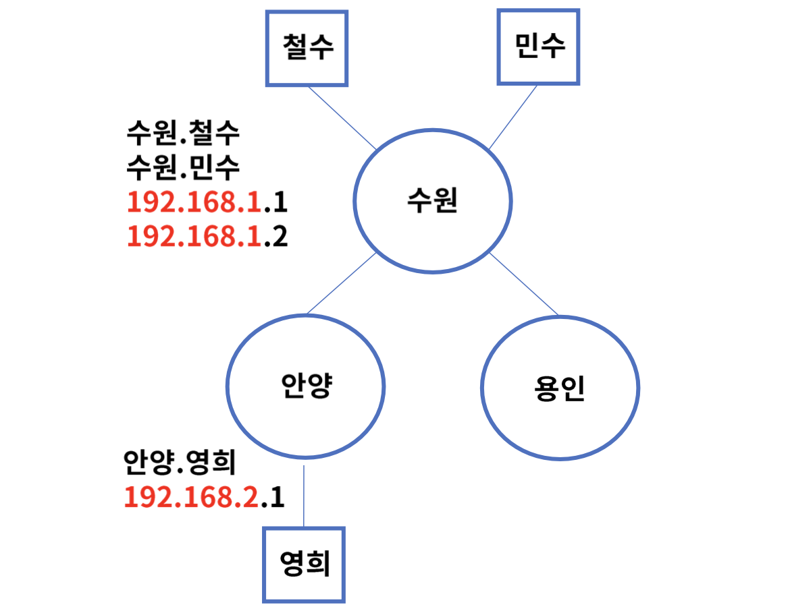

# 네트워크 계층의 역할과 IP의 구조

## 네트워크 계층
- OSI 7 Layer의 3계층으로 패킷 포워딩과 네트워크간 라우터를 통한 라우팅 수행
- IP(Internet Protocol)주소를 사용하여 통신, 계층적 구조라고 한다.
- 대표적인 장비로는 라우터가 있고 L3기능이 있는 스위치라고도 한다. 요즘은 방화벽에도 라우팅 기능이 있기도 하다. 상위계층에서 라우팅을 처리하기도함.

## IP 정의와 구조
### IP(Internet Protocol)
- 네트워크 계층에서 통신하는 주요 프로토콜로 라우팅을 구현하고 본질적인 인터넷을 구축하는 계기가 됨
- 1974년 IEEE 논문 발표 "A Protocol for Packet Network Intercommunication"
- 전송 제어 프로그램의 비연결 테이터그램 서비스로 시작, 이후 해당 부분이 연결 지향 서비스로 보완이 됨
- RFC 760 -> RFC 791 IP, Connectionless(패킷 베이스)
- RFC 761 -> RFC 793 TCP, Connection-oriented service(포트 베이스, 통로)
- TCP/IP 모델의 기원
- 현재 사용중인 버전은 IPv4이며 후속 버전으로 IPv6릴리즈

### IP 주소 확인
- ifconfig로 확인

### IP 구조
- IP는 헤더와 페이로드로 구성되어 있다.
- 헤더는 목적지 & 출발지 IP 주소 등을 포함, 페이로드는 전송되는 데이터를 의미(상위 정보를 포함한다. 예를 들어 TCP, UDP)

### IPv4 헤더 구조
- 최소 20바이트(옵션 미 지정시), 8비트 -> 1바이트, 5x4 바이트

- version: IP 버전, IPv4
- Header Length(HLEN): 헤더의 길이. 4바이트 단위 최소 5(한 줄 당 1, 최소 20 바이트, 최대 15줄)
- Type of Service: 서비스 품질
- Total Packet Length: IP 패킷 전체의 길이 - 바이트 단위 - 최대 65535
- Identifier, Flags, Offset: IP Fragment(IP통신의 기본 펑션) 필드로 단편화와 재조합, 큰 패킷을 작은 패킷으로 나누어 전송하는 경우
- Time to Live: IP 패킷 수명
	- IP는 통신을 하기 위해 출발지부터 목적지 까지 수많은 라우터를 거쳐가야 한다. 보통 64나 128로 세팅 되어 있다. 세팅되어 있지 않은 경우에 잘못된 IP나 경로가 없는 것들은 계속 루프를 돌 수 있다. 
- Protocol ID: 데이터에 포함되어 있는 상위 계층의 프로토콜 정보, TCP 5, UDP 17
- Header Checksum: 오류 검출
- Source, Destination IP Address: 출발지 & 목적지 주소
- IP Header Options & Padding: 옵션, 거의 사용되지 않음/ 디버깅 용도, 통신에는 미관여

### IPv4 헤더 구조 - PCAP

## IP 주소 클래스

### IP 주소 구성
- IP주소는 2진수 31비트로 구성
	- 10101010.01101001.01010101.1001001
- 총 $2^{32}=4294967296=42억9천여개$
- 최초 IP주소 설계시 충분한 수량이었으나 현재는 거의 고갈된 상태
- 한국인터넷정보센터에서 IP 주소 할당 확인 가능
- 2진수는 어렵기 때문에 일반적으로 10진수로 표현
	- 168.126.63.1
	- $2^8 = 256$ 10진수 한 옥텟은 0 ~ 255 까지 가능

### 네트워크와 호스트
- IP 주소는 네트워크 부분과 호스트 부분으로 나뉜다.
- 네트워크는 브로드캐스트 영역(네트워크 안에서는 PC끼리 통신이 가능하다. 이외의 IP끼리는 라우팅이 필요하다.), 호스트는 개별 단말기
	- 192.268.1.0~255 -> 198.168.1 부분 : 네트워크 / 0~255 부분 : 호스트

예를 들어 경기도는 수원, 안양, 용인시로 구성되었다고 가정하면, 
- 같은 수원시에 사는 철수와 민수는 시내버스를 타고 만난다.
- 안양시에 사는 영희를 만나기에 위해서는 시외버를 타야한다.
- 수원, 안양, 용인 = 네트워크 = 라우터
- 철수, 민수, 영희 = 호스트 = PC
- 시내 = 브로드캐스트 스위칭, 시외 = 라우팅

### IP 주소 클래스
- IP주소는 네트워크의 크기에 따라 5개의 클래스(A, B, C, D, E)로 구분
- A클래스: 0.0.0.0 ~ 127.255.2255.255, 호스트는 $2^{24}$

- B클래스: 128.0.0.0.0 ~ 191.255.255.255, 호스트는 $2^{16}$

- C클래스: 192.0.0.0.0 ~ 223.255.255.255, 호스트는 $2^{8}$

- D클래스: 224.0.0.0.0 ~ 239.255.255.255, 멀티캐스트용
- E클래스: 224.0.0.0.0 ~ 255.255.255.254, 연구용

# 라우터와 서브넷팅

## 라우터의 이해
### 역할
- 목적지 IP 주소를 확인하고 하나 또는 그 이상의 네트워크 간의 패킷의 경로르 선택하여 전송
- Router: 네트워크 간의 패킷을 전송해주는 장비
- Routing: 네트워크 간의 패킷을 전달하는 경로를 선택하는 과정, Static & Dynamic
- Routed: 라우터가 라우팅을 해주는 대상, IP

### 인터페이스
- 라우터의 접속 가능한 포트로 통신용 & 관리용으로 구분
- 통신용은 UTP, 광, 무선으로 구성, WAN(Router to Router) 연결은 시리얼 포트도 존재
- 관리용은 보통 콘솔이라 부르며 원격에서 접속 불가 또는 장애시 장비에 직접 연결할 때 사용

## 서브넷 마스크
### 개념
- 서브넷: 부분망, IP주소는 네트워크와 호스트로 구분
- 할당된 네트워크 영역을 좀 더 효율적으로 사용하기 위해 서브넷으로 쪼개어 구성
	- IP를 하나의 브로드캐스팅 영역에서 사용하는 것은 비효율적이다. 따라서 여러 네트워크로 구분한다.
- 네트워크를 여러개의 작은 네트워크로 구분하는 것을 서브넷 마스크라고 한다.
	- 총 C 클래스 254개의 IP 할당 211.109.131.0 ~ 255
 네트워크 별 첫 번째 숫자와 마지막 숫자는 Reserved로 사용하지 않음
첫 번째 숫자: 네트워크 영역을 알림, 마지막 숫자: 브로드 캐스트 주소
1. 254개의 IP주소를 할당했으나 R2망은 3개의 IP만 필요
2. R2망은 총 6개 IP가 필요함을 확인
	- 3명 & 게이트웨이 주소 1(바라보는 라우터 IP)개
	- 네트워크 & 브로드캐스트 주소 2개
3. $2^{3}=8$개로 서브넷 구성이 가장 효율적(서브넷팅은 $2^{n}$으로 구분)
4. 211.109.131.0 ~ 7, 211.109.131.0/29로 구성 (32 - 3)

### 상세
- 디폴트 게이트웨이: 다른 네트워크로 패킷 전송시 거쳐야 하는 거점, 라우터라고 보면 된다.
- Prefix 표기법: 서브넷 마스크 표기를 간단히 표현, 네트워크 영역의 비트"1"의 개수를 의미
	- A 클래스: 255.0.0.0=/8, B클래스: 255.255.0.0=/16, C클래스: 255.255.255.0=/24
- 여러 경로를 가진 라우터의 경우는 보통 1개의 경로를 디폴트 게이트웨이로 설정

### 계산법
- 서브넷 마스크는 2진수로 "1"인 부분은 네트워크, "0"인 부분은 호스트가 된다.
- AND 연산으로 네트워크 주소를 확인한다.
- IP주소: 209.217.12.11, 서브넷 마스크: 255.255.255.0
- 11010001.11011001.00001100.00001011 = 209.217.12.11
- 11111111.11111111.11111111.00000000 = 255.255.255.0
- 11010001.11011001.00001100.00000000 = 209.217.12.0 ->  서브넷 네트워크
- 255.255.255.0은 호스트 영역, "0"이 8개 이므로 $2^8 = 256$개 IP할당, 209.217.12.0/24로 표현 
#### 예제
IP 주소 8.8.8.114, 서브넷 마스크 255.255.255.192의 네트워크 주소와 IP 할당된 개수는?
- 00001000.00001000.00001000.01110010 = 8.8.8.14
- 11111111.11111111.11111111.11000000 = 255.255.255.196
- 00001000.00001000.00001000.01000000 = 8.8.8.64
- 호스트 "0"이 6개 -> $2^6 = 64$개 할당됨 -> 8.8.8.64 ~ 8.8.8.127까지 호스트 범위, 8.8.8.64/26
- 서브넷 마스크는 LAN 설계시 C클래스(256개) 단위로 많이 나눔 

## 라우터의 동작 방식

### Static 라우팅
- 가장 기본적인 라우팅 방식으로 수동으로 경로를 라우터에 설정하여 패킷을 처리한다.
- 경로는 라우팅 테이블에 목적지 IP주소 와 인터페이스 정보를 설정
	- 택배가 페이로드라면 보낼 곳이 IP 주소, 거치는 물류센터들이 인터페이스로 볼 수 있다.
#### 테스트 망 구성

- IP 대역 할당: 211.109.131.0/24 
- Router 대수: 3
- PC 대수: 3
- 세그먼트(경로): 6개
- 서브넷 내누기: 총 6개 네트워크

##### IP네트워크 할당 - 서브넷 마스크
- 211.109.131.0/24를 7개 대역으로 분할 128 x 1 + 32 x 2 + 16 x 4

##### IP 주소 할당 
- 각 서브네팅된 네트워크에 맞추어 IP 설정

##### 각 PC의 정적 라우팅 테이블 작성
- 각 PC의 경로는 1개, 곧 자신의 대역을 제외하고 전부 인접한 라우터(게이트웨이)로 경로 설정
- 보통 디폴트 게이트웨이만 설정

##### 각 라우터들의 정적 라우팅 테이블 구성
- 경로 별 네트워크 대역을 확인하여 커넥티드, 정적, 디폴트 라우팅 설정
- 커넥티드는 포트에 직접 연결된 네트워크 대역, 설정 필요 없음
- 빨간색은 라우터의 포트

- Router 1
	- C(Connected) 131.0/25 is directly connected, e1
	- C 131.128/27 is directly connected, e2
	- C 131.160.27 is directly connected, e3
	- S(Static) 131.208/28 via 131.130
	- S 131.224/28 via 131.130
	- S 131.240/28 via 131.162
	- S* 0.0.0.0/0 via 131.2 (위를 제외한 나머지 모든 주소는 internet에 던진다는 의미)
- Router 2
	- C 131.128/27 is directly connected, e1
	- C 131.208/28 is directly connected, e2
	- C 131.224/28 is directly connected, e3
	- S* 0.0.0.0/0 via 131.129
- Router 3
	- C 131.160/27 is directly connected, e1
	- C 131.240/28 is directly connected, e2
	- S* 0.0.0.0/0 via 131.161

##### 예제 1 (Bob to Linda)

1. Bob은 목적지 Linda 131.242로 통신 시도
2. 목적지 IP 주소는 자기대역이 아니므로 R2로 전달 - 디폴트 게이트웨이
3. R2도 Connected 대역이 아니므로 R1으로 전달
4. R1은 정적 라우팅 테이블을 참조
5. "S 131.240/28 via 131.162" to R3
6. R3은 Connected 대역인 e2포트로 전달
7. Linda 패킷 수신 완료

##### 예제 -2 (Kim to 인터넷(구글))

1. Kim은 목적지 인터넷 8.8.8.8로 통신 시도
2. 목적지 IP 주소는 자기 대역이 아니므로 R2 전달 - 디폴트 게이트웨이
3. R2도 Connected 대역이 아니므로 R1으로 전달
4. R1은 정적 라우팅 테이블을 참조했으나 없는 대역
5. "S* 0.0.0.0/0 via 131.2" 로 전달
6. 인터넷 라우터들을 통해서 구글에 도착

### Hop & TTL
- 전세계 네트워크 호스트는 IP 라우팅을 통해서 연결
- Hop: 소스와 목적지 간의 경로(라우터와 라우터), TTL(Time to Live): 패킷이 폐기되기 전 hop 카운트
- 각 라우터는 패킷이 인입되면 TTL 값을 1씩 감소, TTL=0이 되면 폐기, 부정확한 패킷의 루프 방지

#### traceroute or tracert
- 라우팅 경로 확인 명령어
- 출발지에서 목적지 IP까지 거치는 라우터 최적 경로 확인

# ICMP
## ICMP의 정의
### ICMP(Internet Control Message Protocol)
- 인터넷 제어 메시지 프로토콜
- IP통신은 목적지에 패킷을 정상적으로 전달하는 방법은 있지만 에러 발생시 처리 불가
	- 문제가 있는지 없는지는 IP로는 알 수 없다.
- ICMP는 IP 통신의 에러 상황을 출발지에 전달 & 메시지 제어 역할
- RFC 792, 1981년 소개됨
- ICMP는 IPv4 패킷으로 캡슐화
- Protocol IP = 1
- ping & traceroute 명령어를 사용해서 확인 가능

## ICMP의 기능
### ICMP 포맷 구조
- IP 패킷에 포함

- Type : ICMP 메시지 종류
- Code: 메시지 Type 별 세부 코드 정보
- Checksum: ICMP 헤더 손상 여부 확인

### ICMP Type
- https://www.iana.org/assignments/icmp-parameters/icmp-parameters.xhtml
- 0 ~ 254 까지 정의
- 주로 쓰이는 타입은 아래와 같으며 오류 보고와 정보성으로 나눈다.
- 정보용: 8, 0, 9, 10  
- 오류 보고용: 3, 5, 11, 12

#### Type 8 & 0 Echo Request & Reply
- 네트워크 문제 진단시 사용
- 출발지에서 목적지 IP로 ICMP Echo Request 메시지를 보내면 목적지는 Echo Reply로 응답
- 목적지 도달 여부, RTT(Round-Trip delay Time), hopcount 확인

#### Type 9 & 10 라우터 광고 & 정보 요청
- 자신이 라우터 임을 응답 & 네트워크 진입시 라우터 정보 요청

#### Type 3 Destination Unreachable & Redirect
- 라우터가 IP 패킷을 라우팅 하지 못하는 경우에 발생
- 0 = net unreachable
- 1 = host unreachable
- 2 = protocol unreachable
- 3 = port unreachble
- 4 = fragmentation needed and DF set
- 5 = source route failed
- Type 5 Redirect: 로컬 네트워크에 2개 이상의 경로가 있을 때 더 좋은 경로를 알려줌
	- 이러한 경우 라우터 설정에 오류가 있을 수 있다.

#### Type 11 Time Exceeded & 12 Parameter Problem
- 시간 초과, TTL 값이 0이 되면 출발지에게 응답
- 0 = Time to Live Exceeded
	- 0이 되면 그냥 폐기가 된다.
- 1 = Fragment Reassembly time exceeded
	- fragment의 일부가 TTL이 0이 되는 경우
	- IP Fragementation : IP 패킷을 작은 패킷으로 나누어 전송하고 목적지에서 재조합
	- MTU(Maximum Transmission Unit): IP 패킷을 전송할 수 있는 최대 크기
- type 12: IP 옵션을 잘못 사용하여 라우터에서 패킷 폐기

# DHCP

## DCHP의 정의
### DHCP(Dynamic Host Control Protocol)
- 동적 호스트 구성 프로토콜
- DHCP 서버를 사용하여 클라이언트인 네트워크 장치에 IP 주소를 자동으로 할당
- 1984년 RARP 도입 - RFC 903
- 1985년 BOOTP - RFC 931
	- IP를 할당하고 회수하고 관리하는 부분이 부족
- 1993년 DHCP - RFC 1541 -> RFC 2131
- 요청에 의한 IP 할당으로 효율성 극대화 (온디맨드), IP를 관리하는 입장에서는 IP를 적재적소에 할당할 수 있다.
- 잘못된 IP 설정으로 인한 장애 예방
- IP 변경이 잦은 호스트의 관리

### DHCP 메시지 포맷

- OpCode: 1 Request(client -> server), 2 Reply(server -> client) IP 요청, 응답
- Hardware Type 1. Ethernet(일반적)
- Hardware Address Length: 6, MAC address
- Hop count: 0 에서 시작, 네트워크 망 이동시 증가
- Transaction ID: 클라이언트가 선택하는 랜덤 수, 요청과 응답 매칭
- Seconds: IP 할당 후 경과한 초의 수 
- Flags: 서버 응답에 대해서 0 unicast 또는 1 broadcast 응답 구분 값
- Client IP: 최초 0.0.0.0, Your IP: 할당될 IP, Options: DHCP 메시지 타입 포함

### DHCP 메시지 타입

## DHCP 동작 과정
### IP 할당
- 기본 네트워크 구성: Gateway - Switch - DHCP server - PC
	- 보통은 DHCP 서버가 gateway(router)에 포함되어 있다.
	                                                                                                            1. DHCPDISCOVER: PC 는 DHCP Server를 발견
     2. DHCPOFFER : DHCP Server는 PC에게 IP 제안
     3. DHCPREQUEST : PC는 제안받은 IP 할당을 요청
     4. DHCPACK: DHCP Server는 요청 수락

### IP 갱신
- 지정된 IP 갱신 타임이 도래하면 갱신을 요청
 1. DHCPREQUEST: PC는 기존 IP 재할당을 요청
2. DHCPACK: DHCP Server는 IP 확인 후 요청 수락

### IP 해제
- 사용중인 PC가 전원 off되는 경우
1. DHCPRELEASE: PC는 더 이상 IP 할당이 필요없음을 알림

### DHCP 자동 할당 정보

 