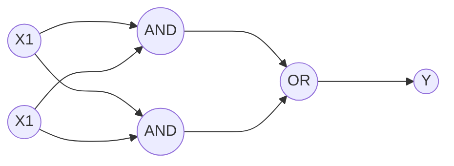

# 딥러닝 핵심 개념
## 전통적인 머신러닝과 딥러닝

전통적인 머신러닝과 딥러닝의 차이는  시대적인 차이가 아니라 모델에서 인공신경망 사용 유무에 있다. 인공신경망도 결국 펼치면 하나의 함수인데 어떤 차이가 있을까?

인공신경망의 기본 단위가되는 퍼셉트론(Perceptron)은 신경계의 기본단위인 뉴런을 본따 만들었다. 뉴런은 앞단의 뉴런에서 여러 신호를 받고 그 중 역치를 넘기는 신호들을 다음 뉴런으로 넘겨준다. (그러나 인공신경망이 뇌와 비슷하지는 않다.)  이와 비슷하게 퍼셉트론도 앞단의 퍼셉트론의 output들을 input으로 받고 weight와 곱하여 선형결합으로 만들어 activation function에 넣어준다. 이후 output을 다음 퍼셉트론에 넘겨준다.

같은 수준의 퍼셉트론이 있는 것을 하나의 층, layer라고 하며 layer의 수가 2개를 넘기는 것을 Deep Neural Network(DNN)이라고 한다.

인공신경망이 많은 layer를 가질 수록, 모델이 복잡해질 수록 더 복잡한 문제들을 풀 수 있게 된다. 그에 따라 가질 수 있는 인공신경망의 모습은 어떤 틀이 있는 것이 아니라 매우 다양하다.

그렇다면 모델을 어떻게 활용할 수 있을까?
아래는 2014년 ILSVRC에서 우승을 한 모델인 GoogLeNet의 모습이다.

 보통 모델을 학습시키기 보다는 이미 학습이 완료된 모델을 활용하여 문제를 해결한다. 앞단의 layer들은 frozen되어 있고 뒷단의 layer를 한두개 정도만 떼어 우리의 문제를 해결하기 위한 데이터들을 넣으면서 우리가 추가한 layer들의 parameter $\theta$ 만 바꾸면서 학습하게 한다. 이것이 가능한 이유는 모델이 학습할때, 앞단부터 뒷단으로 갈수록 아주 작은 단위부터 점점 큰 단위로 추상화하면서 특징을 찾아내기 때문이다. 
 > 예를 들어, input data는 이미지의 픽셀이고 이것에서 아주 작은 부분의 직선, 곡선의 방향, 곡률등을 학습하고 좀더 큰 부분을 추상화하고 경계면을 학습한다든지 점점 큰 부분으로 추상화를 진행한다. 그렇다면 우리가 풀고자 하는 문제의 어느정도 이전 부분들에서 추상화된 부분들로 해당 문제를 해결하리라 기대할 수 있다.
 
 > frozen $\theta$ 를 우리가 가지고 있는 데이터로 아주 살짝 학습시켜보는 방법도 존재한다. 이를 fine tuning이라 하는데 $\theta$ 의 수가 상당히 많기 때문에 굉장히 시간이 오래걸리고 어려운 방법이다.
 
 이렇게 기존 지식을 가져와 학습하는데 이용하는 것을 Transfer Learning(전이학습)이라고 한다. 물론 원래 모델이 해결하려 했던 문제와 우리가 해결하려고 하는 문제의 domain이 어느정도 맞아야하며 데이터의 종류도 같아야한다.

### 왜 지금 딥러닝인가?
시대가 변하면서 데이터의 송수신 환경이 좋아지고 데이터의 양이 상당히 많아졌다. 또한 데이터의 저작권 문제들이 해결되면서 많은 데이터를 다룰 수 있게 되었다. 딥러닝의 경우 parameter의 수가 많기 때문에 data가 적다면 underfitting이 될 수도 ovetfitting이 될 수도 있는 문제가 있기 때문에 충분히 많은 데이터가 필요하다. 또한 컴퓨팅적 리소스의 발전도 딥러닝이 등장할 수 있게 했다. 딥러닝의 연산은 대부분 기본적인 산술연산이므로 어느정도의 연산을 수행할 수 있는 GPU의 병렬연산을 통해 연산을 훨씬 빠르게 수행할 수 있게 했다.

### 머신러닝과 딥러닝의 차이?
머신러닝과 딥러닝은 그 모델을 활용, 학습시키는 부분에 있어 차이가 있다. workflow는 둘다 머신러닝을 기반으로 하기 때문에 당연히 비슷하다. 그러나 feature를 선정하는 부분에 있어서 머신러닝과 딥러닝의 큰 차이가 존재한다. 머신러닝의 경우 feature selection과 feature extraction에 상당히 많은 노력을 쏟아야하는 반면 딥러닝의 경우 해당 작업을 모델이 대신 해준다. 이는 앞서 말한 작은 부분에서 큰 부분으로 추상화를 진행하는 것과 관련이 있다. 그렇게 학습을 진행하면서 어떤 추상화된 부분이 중요하고 중요하지 않은지 모델이 학습하는 것이다. 이러한 과정을 머신러닝에서 보면 feature를 추가하거나 제거하는 과정으로 볼 수도 있다. 
> 사람의 손을 찍은 X-ray 사진을 보고 나이를 맞히는 모델을 만든다고 했을 때, 머신러닝의 경우는 어떤 특징이 중요할지 직접 feature를 정해서 데이터를 얻고 모델에 넣어줘야한다. 반면에 딥러닝은 이미지의 픽셀을 데이터로 넣어주면 모델이 학습하면서 중요한 특징들을 뽑아낸다.

이러한 차이에서 장단점이 존재한다.
- 장점 
	- 인간이 예측을 함에 있어 data에 대해 가지고 있는 선입견이나 편견을 배제할 수 있다.
	- 직접 만들어야하는 부분들이 적어진다.
- 단점 ( 문제의 난이도, 클래스 분류의 명확함 등에 따라 다르긴 하지만)
	- 상당히 많은 양의 레이블된 데이터들이 필요하다
	- 만들어낸 실제로 유용한 요소들을 배제한다. 

## 딥러닝 핵심 개념
### (Single-Layer) Perceptron(단층 퍼셉트론)

perceptron
: 신경계의 기본단위인 뉴런을 본따 만든 인공신경망의 기본 단위이다. perceptron은 기본적으로 2가지 연산을 구행하여 출력값을 계산한다.
	1. 입력 데이터와 $\theta$의 선형 조합을 계산한다.
	2. 선형 조합의 결과에 Activation function(활성화 함수)를 적용한다. 
	
#### Activation function 
activation function은 입력데이터에 대해서 어떤 출력을 내보낼지 결정한다. activation function은 non-linear function으로 만일 activation function이 linear function이라면 아무리 많은 perceptron과 layer를 쌓아도 결국 해당 신경망은 linear combination이 될 수 밖에 없고 그렇다면 해당 모델은 linear 한 문제 밖에 풀 수 없게 된다. 
그렇기 때문에 non-linear function인 activation function을 적용하여 비선형 문제를 풀 수 있게 한다. 

activation funtion
: 이전 layer의 모든 입력에 대한 가중합을 받아 출력값을 생성하여 다음 layer로 전달하는 non-linear function이다.

결국 문제를 푸는데 있어서 중요한 것은 적합한 $\theta$ 값을 찾는 것에 있고 이는 Cost function을 최소화 하는 $\theta$ 를 구하는 것으로 해결할 수 있다. 
그러나 layer를 갖는 ANN 구조에서는 output에 대한 cost fuction으로 모든 $\theta$를 조절할 수 없다. cost function을 각각의 layer에 적용하면서 최적의 $\theta$값을 찾아야 한다. 
(이는 layer의 미분과 cost function의 곱으로 해결한다.)

activations function들을 적용했을 때 발생하는 문제들을 해결하기 위해 다른 activation function들이 계속 생겨났다.
- step fuction : 미분이 정의되지 않는 부분을 제외하고 모든 미분 값이 0
- sigmoid : 0이 아닌 미분 값을 가지나, 출력이 0과 1사이
- tanh :  출력이 음수 값 까지 가질 수 있으나 미분 값이 1보다 작다. (sigmoid도 마찬가지)
- ReLU : 미분 값이 1보다 크기 때문에 미분을 해도 cost fuction이 0으로 수렴하지 않는다.

전반적으로 ReLU 계열 함수를 많이 사용한다.

기존의 single layer perceptron은 AND, OR 문제는 해결할 수 있었다.
($\theta_1$ : 0.5, $\theta_2$ : 0.5)
- AND

|$x_1$|$x_2$|선형결합|Threshold|prediction|정답|
|:---:|:---:|:----:|:-------:|:--------:|:-:|
|  1  |   1 |  1   |    0.7  |   1		| 1 |
|  0  |   1 |  0.5 |    0.7  |   0		| 0 |
|  1  |   0 |  0.5 |    0.7  |   0		| 0 |
|  0  |   0 |  0   |    0.7  |   0		| 0 |

- OR

|$x_1$|$x_2$|선형결합|Threshold|prediction|정답|
|:---:|:---:|:----:|:-------:|:--------:|:-:|
|  1  |   1 |  1   |    0.2  |   1		| 1 |
|  0  |   1 |  0.5 |    0.2  |   1		| 1 |
|  1  |   0 |  0.5 |    0.2  |   1		| 1 |
|  0  |   0 |  0   |    0.2  |   0		| 0 |

그러나 XOR 문제의 경우 선형분리불가한 문제로 단일 퍼셉트론으로는 풀 수 없다.(step function을 다르게 조절하면 풀 수 있는 방법이 있다고 한다!) 

### Multt-Layer Perceptron(다층 퍼셉트론)
XOR의 경우 $x_1$, $x_2$ 둘 중 하나만 참일 때만 참이다. 즉 $!x_1$ AND $x_2$ 와 $x_1$ AND $!x_2$ 의 OR연산으로 풀이가 가능하다.

Multi Layer가 가능해지면서 좀 더 복잡한 문제들을 풀 수 있게 되었지만 그로인한 Overfitting에 대한 문제가 발생한다. 복잡한 문제를 풀 수록 generalization에 문제가 생긴다.

### Artificial Neural Network (인공 신경망)
Perceptron을 모은 Layer를 깊이 방향으로 쌓아나가면서 복잡한 모델을 만들어내어 보다 더 어려운 문제를 풀어낼 수 있음 

Input Layer
: 외부로부터 데이터를 입력 받는 신경망 입구의 Layer

Hidden Layer
: Input Layer 와 Output Layer 사이의 모든 Layers, activation function을 적용하여 출력 값을 결정한다.

Output Layer
: 모델의 최종 연산 결과를 내보내는 신경망의 출구 Layer, 문제에 따라 이후의 처리를 정하게 된다. activation function을 적용하는 것과 유사하게 sigmoid, softmax 등을 적용하여 문제에 맞는 output을 출력하도록 한다.
	> 다중 클래스 분류의 경우 output에 softmax를 적용하여 해당 클래스일 확률을 출력하게 하고 이를 label과 비교해 cross-entropy를 계산하여 cost function을 정의한다.
