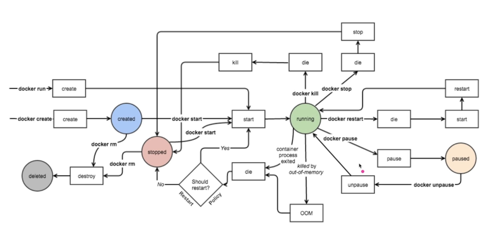
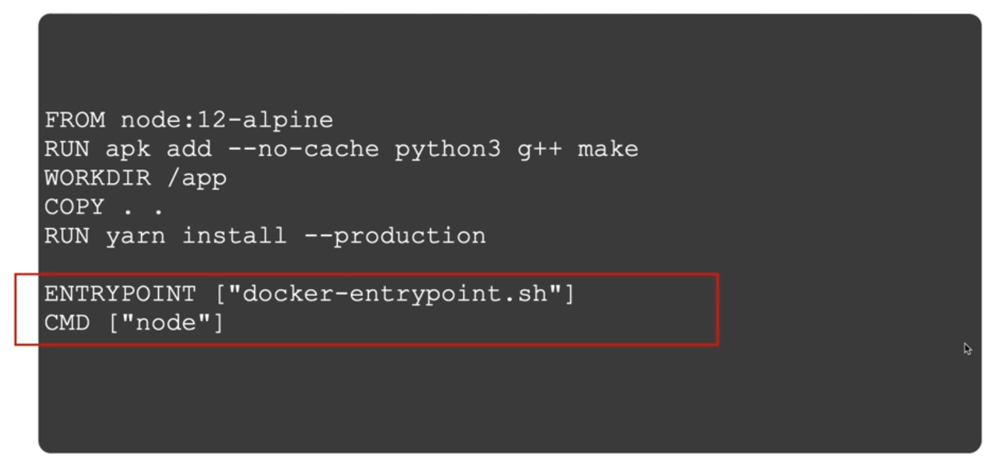

#Docker #Ops #fastcampus

# Container life cycle

도커의 경우 실행상태로 가는 방법이 두 가지가 존재한다.
- docker run 을 이용
- docker create로 컨테이너를 만들고 start로 실행
실행 중인 컨테이너를 pause할 수 있다.
stop 명령어로 중단할 수도 있는데, 이 경우 컨테이너가 삭제되지는 않는다. 

좀 더 자세한 도식도 

## 컨테이너 시작
도커 create/run 명령어 모두 이미지가 없을 경우 자동으로 pull을 먼저 수행하여 이미지를 다운로드 받는다.
```shell
# 컨테이너 생성, 시작
docker create [image]
docker start [container]

# 컨테이너 생성 및 시작
docker run
```

### 컨테이너 시작 주요 옵션
```shell
docker run \
  -i \                             # 호스트의 표준 입력을 컨테이너와 연결(interactive)
  -t \                             # TTY 할당
  --rm \                           # 컨테이너 실행 종료 후 자동 삭제
  -d \                             # 백그라운드 모드로 실행 (detached)
  --name hello-world \             # 컨테이너 이름 지정
  -p 80:80 \                       # 호스트 - 컨테이너 간 포트 바인딩
  -v /opt/example:/example \       # 호스트 - 컨테이너 간 볼륨 바인딩
  fastcampus/hello-world:latest \  # 실행할 이미지
  my-command                       # 컨테이너 내에서 실행할 명령어
```
- `-i, -t`  보통 같이 묶어서 사용한다. 
	- 호스트의 키보드 입력이 컨테이너로 전달될 수 있게 해준다.  
	- 컨테이너에 TTY를 할당하여 터미널 명령어 수행을 정상적으로 이용할 수 있도록 해준다.
	- 컨테이너에서 셸을 실행할 때 주로 사용한다.
- `-d` 도커 컨테이너로 서비스 운영을 하게 되면 컨테이너가 백그라운드에서 데몬 형태로 동작을 해야한다.
- `--name` 을 주지 않으면 자동으로 이름을 생성한다.
- `-p` 호스트 운영체제와 컨테이너간의 네트워크 포트를 바인딩
- `-v` 호스트와 컨테이너간의 파일시스템, 디렉토리를 마운트 하기위한 옵션. 컨테이너가 호스트 운영체제의 파일시스템에 접근할 수 있는 상태가 된다.
- 선택적으로 커맨드를 추가적으로 기입할 수 있다. CMD 대신 해당 명령어를 실행한다.

## 컨테이너 상태확인
```shell
# 실행중인 컨테이너 상태 확인
docker ps

# 전체 컨테이너 상태 확인
docker ps -a

# 컨테이너 상세 정보 확인
docker inspect [container]
```
- 컨테이너에 문제가 생겼을 때 inspect를 사용해 컨테이너의 상세정보를 확인한다고 함
- inspect에서 container config도 확인할 수 있다. 어떤 엔트리포인트와 커맨드 사용했는지 확인 가능

## 컨테이너 종료
```shell
# 컨테이너 종료 (SIGTERM 시그널 전달)
docker stop [container]

# 컨테이너 강제 종료(SIGKILL시그널 전달)
docker kill [container]

# 모든 컨테이너 종료
docker stop $(docker ps -a -q)
```

- 안전하게 종료하냐 강제로 종료하느냐의 차이

## 컨테이너 삭제
```shell
# 컨테이너 삭제 (실행중인 컨테이너 불가)
docker rm [contatiner]

# 컨테이너 강제 종료 후 삭제 (SIGKILL 시그널 전달)
docker rm -f [container]

# 컨테이너 실행 종료 후 자동 삭제
docker run --rm ...

# 중지된 모든 컨테이너 삭제
docker container prune
```

# Entrypoint, Command
도커 컨테이너가 실행될 때, 하나의 프로세스를 실행하게 되는데 그때 중요한 개념이 엔트리포인트와 커맨드이다.

***엔트리포인트 (Entrypoint)**
도커 컨테이너가 실행할 때 고정적으로 실행되는 스크립트 혹은 명령어로 생략할 수 있으며, 생략될 경우 커맨드에 지정된 명령어로 수행

***커맨드 (Command)**
도커 컨테이너가 실행할 때 수행할 명령어 혹은 엔트리포인트에 지정된 명령어에 대한 인자값

 
둘 다 사용되는 경우, 이러한 형태로 엔트리포인트가 프리픽스 처럼 지정되고 그 뒤에 커맨드가 전달되는 형태로 전체 커맨드가 완성이 된다.

## Dockerfile의 엔트리 포인트와 커맨드
 
dockerfile 내에 CMD는 필수적으로 들어가는 요소이고 entrypoint는 선택적으로 넣을 수 있는 값이다. 
cmd는 도커 이미지가 실행될 때, 기본적으로 실행될 명령어를 지정한다.
entrypoint는 cmd가 실행되기 앞서 실행되는 프로그램으로 생각하면 된다.

## 도커 명령어의 엔트리포인트와 커맨드
```shell
docker run --entrypoint sh ubuntu:focal
docker run --entrypoint echo ubuntu:focal hello world
```
이미지에 지정된 엔트리포인트와 커맨드를 오버라이드 할 수 있다. 도커 컨테이너 실행 시에 엔트리포인트와 커맨드 모두 변경 가능하다.

# 환경변수
도커 컨테이너를 실행할 때 필요한 변수, 파일을 주입을 할 수 있어야 한다. 컨테이너에 변수를 주입하는 방법중 대표적인 방법은 환경변수를 이용하는 것이다.
```shell
# 환경변수 목록을 넘겨준다.
docker run -e [variable def]

# 환경변수가 라인으로 분리된 파일을 넘겨준다.
docker run --env-file [file]
```
유명한 프레임워크들의 이미지 공식문서를 확인해보면 환경변수로 해당 컨테이너 실행방법을 제어하는 것을 확인할 수 있다.
https://hub.docker.com/_/nginx

# 명령어 실행
```shell
# 실행중인 컨테이너에 명령어를 실행
docker exec [container] [command]

# my-nginx 컨테이너에 bash 셸로 접속하기
docker exec -i -t my-nginx bash

# my-nginx 컨테이너의 환경변수 확인하기
docker exec my-nginx env
```
- 기존에 실행중인 컨테이너에 대해서 특정 이슈 해결을 위해서 가장 빈번하게 사용되는 명령어
- 예를들어 `my-nginx`  컨테이너에서 발생한 이슈를 해결하려면 해당 컨테이너에 접근하여 문제를 해결해야 한다. 이때 exec를 사용하여 해당 컨테이너에 접속하여 문제를 해결할 수 있다. 이 경우 해당 컨테이너에 셸이 설치되어 있어야 한다.

# 네트워크
## 도커 네트워크 구조
 
- `eth0` : 호스트에서 사용하는 기본 네트워크
- `veth` : virtual eth


- 도커를 호스트 운영체제에 설치를 하고 나면 기본적으로 여러가지 네트워크 드라이브들이 설치가 된다.
- 기본적으로는 도커 컨테이너를 실행할 때 사용할 네트워크를 지정할 수 있다. 따로 지정하지 않으면 기본적으로 생성되는 docker0 이라고 하는 브릿지 네트워크를 사용한다.
- 컨테이너 내부에서 네트워크 장치 목록을 확인해보면 `eth0` 과 `l0(127.0.0.1, 루프백)` 두 가지 장치가 설치되어 있는 것을 확인할 수 있다. 내부적으로는 ip를 가지게 된다. 그리고 이것이 호스트 서버와 연결 되어야 한다. 이때  `docekr0`이 연결하는 역할을 한다.
- 컨테이너가 생성됨과 동시에 호스트에는 컨테이터의 `eth0` 에 대응되는 `가상 eth` 가 하나씩 생기게 된다.

## 컨테이너 포트 노출 (publish)
컨테이너의 포트를 호스트의 IP:PORT와 연결하여 서비를 노출한다.
```shell
docker run -p [HOST IP:PORT]:[CONTAINER PORT] [container]

# nginx 컨테이너의 80번 포트를 호스트 모든 IP의 80번 포트와 연결하여 실행
docekr run -d -p 80:80 nginx

# nginx 컨테이너의 80번 포트를 호스트 127.0.0.1 IP의 80번 포트와 연결하여 실행
docker run -d -p 127.0.0.1:80:80 nginx

# nginx 컨테이너의 80번 포트를 호스트의 사용 가능한 포트와 연결하여 실행
docker run -d -p 80 nginx
```

## expose vs publish
```shell
# expose 옵션은 그저 문서화 용도
docker run -d --expose 80 nginx

# publish 옵션은 실제 포트를 바인딩
docker run -d -p nginx
```
- expose는 dockerfile을 빌드할 때도 있는 명령어로 docker run 명령어에도 옵션이 존재한다.
- 문서화하는 용도일 뿐 실제로 파인딩을 하지는 않는다.

## 도커 네트워크 드라이버

### 네트워크 종류로 구분

https://docs.docker.com/network/ 의 Network drivers에서 도커에서 지원하는 드라이버 목록 확인 가능
- 드라이버를 native driver와 remote driver로 나눌 수 있다.

### 네트워크 동작 방식으로 구분

- single host와 multi host로 나눌 수 있다.
- 네트워크 드라이버를 선택해서 새로운 브릿지를 만들 수도 있다.
- overlay의 경우 여러 서버가 존재한다고 했을 때, 각각의 서버에 있는 컨테이너들을 연결시키는 가상의 네트워크이다. 멀티호스트로 동작하기 때문에 주로 오케스트레이션 시스템에서 많이 사용하는 네트워크 드라이브이다.

### 명령어 사용
```shell
docker run --net [network] 
```
해당 명령어로 어떤 네트워크를 사용할지 지정할 수 있다.
#### none
컨테이너가 네트워크 기능이 필요 없을 때 혹은  커스텀 네트워킹을 사용해야할 니즈가 있을 때, 기본 드라이버를 none으로 설정하고 사용할 수 있다.
```shell
docker run -i -t --net none ubuntu:focal
```

- `docker inspect`로 확인해보면 IPAddress가 할당되어 있지 않은것을 확인할 수 있다.

- apt update 사용시 네트워크 오류가 발생하는 것을 확인할 수 있다.

#### host
```shell
docker run -d --net host grafana/grafana
```
host의 경우 도커에서 제공하는 가상 네트워크를 사용하는 것이 아닌 직접 호스트 네트워크에 붙어서 사용하는 개념이다. 호스트 네트워크를 사용하는 경우에는 포트 바인딩을 하지 않더라도 호스트 네트워크를 사용하기 때문에 바로 접속을 할 수 있게 된다.

- inspect에서 hostname으로 hostname을 사용하는 것을 확인할 수 있으며 호스트 네트워크를 사용하므로 ipaddress가 없는 것을 확인할 수 있다.


#### bridge
기본으로 사용되는 dokcer0 가 아니라 사용자 정의의 브릿지 네트워크를 만들고 나서 사용해봄
```shell
docker network create --driver=bridge fastcampus

docker run -d --network=fastcampus --net-alias=hello nginx
docker run -d --network=fastcampus --net-alias=grafana grafana/grafana
```
- `net-alias`는 브릿지에서만 사용할 수 있는 옵션이다. 브릿지 네트워크 안에서 해당 도메인 네임으로 컨테이너 IP를 검색할 수 있도록 내부 도메인에 저장을 해준다.
- 같은 브릿지를 사용하는 컨테이너에 접속해서 다른 컨테이너에 해당 도메인으로 접근할 수 있는 것을 확인할 수 있다.


### 실습 확인
- 컨테이너 수 만큼 veth가 생성된 것을 확인할 수 있다. 제일 하단 컨테이너는 host네트워크 이므로 없다.


- br로 시작하는 주소들은 bridge로 하나는 minikube로 인해 생성된것임.

# 볼륨
도커 볼륨에 대해서 이해하기 위해서는 도커 레이어 아키텍처를 이해해야한다. 그리고 도커 볼륨을 사용하는 방법에는 호스트 볼륨, 볼륨 컨테이너 그리고 도커 볼륨의 세가지 방법이 있다.

- 이미지 레이어와 컨테이너 레이어로 나뉘어져 있는 것을 확인할 수 있다.
- `docker build -t app .` 을 사용하면 `Dockerfile` 이라는 명세파일을 기준으로 도커 이미지를 빌드하게 된다. 이미지를 들여다보면 레이어 구조로 되어있는데 dockerfile의 명령어들이 순차적으로 레이어가 쌓이는 것으로 보면 된다.
- 레이어 구조로 여러 장점을 가지게 된다. 예를 들어 이미지에 변경 사항이 생겨서 특정 레이어에 변경 사항이 있다면 이전 레이어들은 변경될 필요가 없고 해당 레이어 부분에 브랜치가 따지면서 새로운 레이어들을 만들게 된다. 이런식으로 도커 이미지는 이미지의 여러 버전이 생긴다 하더라도 저장공간을 덜 차지하게하는 레이어 구조를 가지고 있다.
- 도커 이미지를 run 명령어로 실행하게 되면 해당 컨테이너는 image layer와 container layer 두 가지의 레이어를 가지게 된다. 
	- 이미지 레이어는 이미지를 불러들여서 사용하는 것이기 때문에 항상 동일하고 읽기 전용으로 사용하게 된다. 따라서 변경사항을 가할 수 없게 된다.
	- 컨테이너 상에서 새로운 파일을 쓴다거나 할때에는 기본적으로 컨테이너 레이어에서 파일을 쓰게 된다. 컨테이너 레이어는 read/write 권한을 가지게 된다. 중요한 점은 컨테이너 레이어는 컨테이너 종료가 되면 함께 삭제되므로 임시 데이터 저장소로 봐야한다.
- 컨테이너 상에서 볼륨을 영구적으로 사용하는 방법은 세가지 방법이 있다.
## 호스트 볼륨
가장 간단하고 직관적인 방법으로, 호스트의 디렉토리를 컨테이너의 특정 경로에 마운트 한다.
```shell
# 호스트의 /opt/html 디렉토리를 nginx의 웹 루트 디렉토리로 마운트
docker run \
  -d \
  -v $(pwd)/html:/usr/share/nginx/html \
  -p 80:80 \
  nginx
```

## 볼륨 컨테이너
특정 컨테이너의 볼륨 마운트를 공유할 수 있다. 

- data-only 컨테이너를 볼륨 컨테이너로 생각하면 된다. 볼륨을 특정 어플리케이션 컨테이너에서 마운트를 시키는 것이 아니라 볼륨 컨테이너에서 볼륨 마운트만 지정하고 아무 것도 하지 않는 컨테이너를 만들어 둔다. 그 상태에서 어플리케이션 컨테이너는 해당 컨테이너를 참조해서 볼륨 컨테이너로 사용할 수 있다. data-only 컨테이너의 마운트 목록을 어플리케이션 컨테이너가 공유받을 수 있다.
```shell
docker run \
  -d \
  -it \
  -v $(pwd)/html:/usr/share/nginx/html \
  --name web-volume \
  ubuntu:focal
# web-volume 컨테이너의 볼륨을 공유
docker run \
  -d \
  --name fastcampus-nginx \
  --volumes-from web-volume \
  -p 80:80 \
  nginx
# web-volume 컨테이너의 볼륨을 공유
docker run \
  -d \
  --name fastcampus-nginx2 \
  --volumes-from web-volume \
  -p 8080:80 \
  nginx
```

## 도커 볼륨
도커가 제공하는 볼륨 관리 기능을 활용하여 데이터를 보존한다.
기본적으로 `/var/lib/docker/volumes/${volume-name}/_data`에 데이터가 저장된다.
```shell
# 도커 볼륨 생성
docker volume create --name db

docker volume ls
# 도커 볼륨을 마운트 / mysql이 데이터를 쌓는 경로
docker run \
  -d \
  --name fastcampus-mysql \
  -e MYSQL_DATABASE=fastcampus \
  -e MYSQL_ROOT_PASSWORD=fastcampus \
  -v db:/var/lib/mysql \
  -p 3306:3306 \
  mysql:5.7
```

## 읽기전용 볼륨 연결
볼륨 연결 설정에 :ro 옵션을 통해 읽기 전용 마운트 옵션을 설정할 수 있다.
```shell
# 도커 볼륨을 읽기 전용 마운트 (readonly=ro)
docker run \
  -d \
  -v $(pwd)/html:/usr/share/nginx/html:ro \
  -p 80:80 \
  --name ro-nginx \
  nginx
```

# 로그
컨테이너를 관리함에 있어서 로그를 어떻게 관리할 것인가는 가장 중요하게 고민해야하는 주제 중 하나이다.
어플리케이션에서 로그를 다룰 때
- 해당 프레임워크에서 제공하는 로그 프레임워크를 사용해서 표준 출력으로 로그를 내보내거나
- syslog로 내보낸다거나
- 엘라스틱서치 같은 외부 저장소로 내보낸다거나
하는 등의 다양한 방식으로 어플리케이션 단에서 구현이 된다.
도커 컨테이너에서 로그를 다루기 위해서는 어플리케이션에서 로그를 표준 출력과 표준 오류로 내보내는 것을 표준으로 삼아야한다.

- 어플리케이션 컨테이너 단에서 표준 출력과 표준 에러로 로그를 내보낸다.
- 도커가 해당 로그를 쌓아서 로깅 드라이버가 처리할 수 있도록 한다.
- 도커는 다양한 로깅 드라이버를 제공한다.

## 로그 확인하기
```shell
# 전체 로그 확인
docker logs [container]

# 마지막 로그 10줄 확인
docker logs --tail 10 [container]

# 실시간 로그 스트림 확인 follow
docker logs -f [container]

# 로그마다 타임스탬프 표시
docker logs -f -t [container]
```

## 호스트 운영체제의 로그 저장 경로
이 경우는 로그드라이버를 `json-file`로 했을 때에만 유효하다. 해당 로그 드라이버는 인라인 json 형태의 로그를 file로 저장한다는 의미로 해당 파일이 호스트 운영체제에 저장되게 된다.
```shell
cat /var/lib/docker/containers/${CONTAINER_ID}/${CONTAINER_ID}-json.log
```
- 키와 밸류로 각 내용을 확인할 수 있는데 로그에 어떤 내용이 담겨있는지 어떤 스트림인지 해당 시간이 언제인지 등의 정보를 확인할 수 있다. 


## 로그 용량 제한하기
기본적으로 도커 엔진을 운영체제에 설치하게 되면 로그에 대한 용량 제한이 설정되어 있지 않다. 컨테이너 단위로 로그 용량 제한을 할 수 있지만, 도커 엔진에서 기본 설정을 진행할 수도 있다. (운영환경에서 필수 설정)
```shell
# 한 로그 파일 당 최대 크기를 3Mb로 제한, 최대 로그 파일 5개로 로테이팅
docker run \
-d \
--log-driver=json-file \
--log-opt max-size=3m \
--log-opt max-file=5 \ 
nginx
```

## 도커 로그 드라이버

- 로그를 파일로 남기는 경우에 log agent를 이용하여 해당 로그를 중앙화된 로그 시스템에 쌓아놓고 관리할 수 있다. 
- 이외에도 다양한 로그 드라이버를 use case에 따라서 사용할 수 있다.
