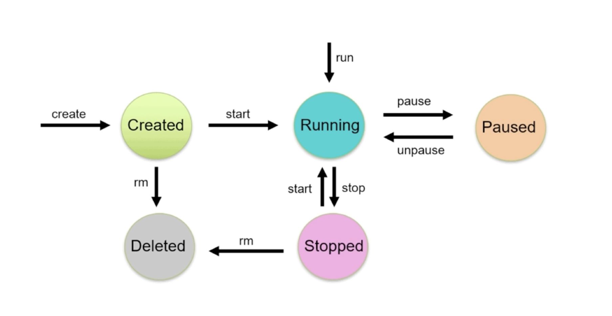
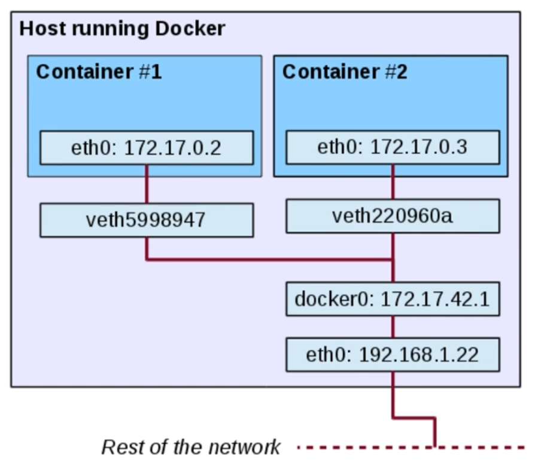

#Docker #Ops #fastcampus

# Container life cycle

도커의 경우 실행상태로 가는 방법이 두 가지가 존재한다.
- docker run 을 이용
- docker create로 컨테이너를 만들고 start로 실행
실행 중인 컨테이너를 pause할 수 있다.
stop 명령어로 중단할 수도 있는데, 이 경우 컨테이너가 삭제되지는 않는다. 
![[images/2.png]]
좀 더 자세한 도식도 

## 컨테이너 시작
도커 create/run 명령어 모두 이미지가 없을 경우 자동으로 pull을 먼저 수행하여 이미지를 다운로드 받는다.
```shell
# 컨테이너 생성, 시작
docker create [image]
docker start [container]

# 컨테이너 생성 및 시작
docker run
```

### 컨테이너 시작 주요 옵션
```shell
docker run \
  -i \                             # 호스트의 표준 입력을 컨테이너와 연결(interactive)
  -t \                             # TTY 할당
  --rm \                           # 컨테이너 실행 종료 후 자동 삭제
  -d \                             # 백그라운드 모드로 실행 (detached)
  --name hello-world \             # 컨테이너 이름 지정
  -p 80:80 \                       # 호스트 - 컨테이너 간 포트 바인딩
  -v /opt/example:/example \       # 호스트 - 컨테이너 간 볼륨 바인딩
  fastcampus/hello-world:latest \  # 실행할 이미지
  my-command                       # 컨테이너 내에서 실행할 명령어
```
- `-i, -t`  보통 같이 묶어서 사용한다. 
	- 호스트의 키보드 입력이 컨테이너로 전달될 수 있게 해준다.  
	- 컨테이너에 TTY를 할당하여 터미널 명령어 수행을 정상적으로 이용할 수 있도록 해준다.
	- 컨테이너에서 셸을 실행할 때 주로 사용한다.
- `-d` 도커 컨테이너로 서비스 운영을 하게 되면 컨테이너가 백그라운드에서 데몬 형태로 동작을 해야한다.
- `--name` 을 주지 않으면 자동으로 이름을 생성한다.
- `-p` 호스트 운영체제와 컨테이너간의 네트워크 포트를 바인딩
- `-v` 호스트와 컨테이너간의 파일시스템, 디렉토리를 마운트 하기위한 옵션. 컨테이너가 호스트 운영체제의 파일시스템에 접근할 수 있는 상태가 된다.
- 선택적으로 커맨드를 추가적으로 기입할 수 있다. CMD 대신 해당 명령어를 실행한다.

## 컨테이너 상태확인
```shell
# 실행중인 컨테이너 상태 확인
docker ps

# 전체 컨테이너 상태 확인
docker ps -a

# 컨테이너 상세 정보 확인
docker inspect [container]
```
- 컨테이너에 문제가 생겼을 때 inspect를 사용해 컨테이너의 상세정보를 확인한다고 함
- inspect에서 container config도 확인할 수 있다. 어떤 엔트리포인트와 커맨드 사용했는지 확인 가능

## 컨테이너 종료
```shell
# 컨테이너 종료 (SIGTERM 시그널 전달)
docker stop [container]

# 컨테이너 강제 종료(SIGKILL시그널 전달)
docker kill [container]

# 모든 컨테이너 종료
docker stop $(docker ps -a -q)
```

- 안전하게 종료하냐 강제로 종료하느냐의 차이

## 컨테이너 삭제
```shell
# 컨테이너 삭제 (실행중인 컨테이너 불가)
docker rm [contatiner]

# 컨테이너 강제 종료 후 삭제 (SIGKILL 시그널 전달)
docker rm -f [container]

# 컨테이너 실행 종료 후 자동 삭제
docker run --rm ...

# 중지된 모든 컨테이너 삭제
docker container prune
```

# Entrypoint, Command
도커 컨테이너가 실행될 때, 하나의 프로세스를 실행하게 되는데 그때 중요한 개념이 엔트리포인트와 커맨드이다.

***엔트리포인트 (Entrypoint)**
도커 컨테이너가 실행할 때 고정적으로 실행되는 스크립트 혹은 명령어로 생략할 수 있으며, 생략될 경우 커맨드에 지정된 명령어로 수행

***커맨드 (Command)**
도커 컨테이너가 실행할 때 수행할 명령어 혹은 엔트리포인트에 지정된 명령어에 대한 인자값

![[images/4.png]]
둘 다 사용되는 경우, 이러한 형태로 엔트리포인트가 프리픽스 처럼 지정되고 그 뒤에 커맨드가 전달되는 형태로 전체 커맨드가 완성이 된다.

## Dockerfile의 엔트리 포인트와 커맨드
![[images/5.png]]
dockerfile 내에 CMD는 필수적으로 들어가는 요소이고 entrypoint는 선택적으로 넣을 수 있는 값이다. 
cmd는 도커 이미지가 실행될 때, 기본적으로 실행될 명령어를 지정한다.
entrypoint는 cmd가 실행되기 앞서 실행되는 프로그램으로 생각하면 된다.

## 도커 명령어의 엔트리포인트와 커맨드
```shell
docker run --entrypoint sh ubuntu:focal
docker run --entrypoint echo ubuntu:focal hello world
```
이미지에 지정된 엔트리포인트와 커맨드를 오버라이드 할 수 있다. 도커 컨테이너 실행 시에 엔트리포인트와 커맨드 모두 변경 가능하다.

# 환경변수
도커 컨테이너를 실행할 때 필요한 변수, 파일을 주입을 할 수 있어야 한다. 컨테이너에 변수를 주입하는 방법중 대표적인 방법은 환경변수를 이용하는 것이다.
```shell
# 환경변수 목록을 넘겨준다.
docker run -e [variable def]

# 환경변수가 라인으로 분리된 파일을 넘겨준다.
docker run --env-file [file]
```
유명한 프레임워크들의 이미지 공식문서를 확인해보면 환경변수로 해당 컨테이너 실행방법을 제어하는 것을 확인할 수 있다.
https://hub.docker.com/_/nginx

# 명령어 실행
```shell
# 실행중인 컨테이너에 명령어를 실행
docker exec [container] [command]

# my-nginx 컨테이너에 bash 셸로 접속하기
docker exec -i -t my-nginx bash

# my-nginx 컨테이너의 환경변수 확인하기
docker exec my-nginx env
```
- 기존에 실행중인 컨테이너에 대해서 특정 이슈 해결을 위해서 가장 빈번하게 사용되는 명령어
- 예를들어 `my-nginx`  컨테이너에서 발생한 이슈를 해결하려면 해당 컨테이너에 접근하여 문제를 해결해야 한다. 이때 exec를 사용하여 해당 컨테이너에 접속하여 문제를 해결할 수 있다. 이 경우 해당 컨테이너에 셸이 설치되어 있어야 한다.

# 네트워크
## 도커 네트워크 구조

- `eth0` : 호스트에서 사용하는 기본 네트워크
- `veth` : virtual eth


- 도커를 호스트 운영체제에 설치를 하고 나면 기본적으로 여러가지 네트워크 드라이브들이 설치가 된다.
- 기본적으로는 도커 컨테이너를 실행할 때 사용할 네트워크를 지정할 수 있다. 따로 지정하지 않으면 기본적으로 생성되는 docker0 이라고 하는 브릿지 네트워크를 사용한다.
- 컨테이너 내부에서 네트워크 장치 목록을 확인해보면 `eth0` 과 `l0(127.0.0.1, 루프백)` 두 가지 장치가 설치되어 있는 것을 확인할 수 있다. 내부적으로는 ip를 가지게 된다. 그리고 이것이 호스트 서버와 연결 되어야 한다. 이때  `docekr0`이 연결하는 역할을 한다.
- 컨테이너가 생성됨과 동시에 호스트에는 컨테이터의 `eth0` 에 대응되는 `가상 eth` 가 하나씩 생기게 된다.

## 컨테이너 포트 노출
컨테이너의 포트를 호스트의 IP:PORT와 연결하여 서비를 노출한다.
```shell
docker run -p [HOST IP:PORT]:[CONTAINER PORT] [container]

# nginx 컨테이너의 80번 포트를 호스트 모든 IP의 80번 포트와 연결하여 실행
docekr run -d -p 80:80 nginx

# nginx 컨테이너의 80번 포트를 호스트 127.0.0.1 IP의 80번 포트와 연결하여 실행
docker run -d -p 127.0.0.1:80:80 nginx

# nginx 컨테이너의 80번 포트를 호스트의 사용 가능한 포트와 연결하여 실행
docker run -d -p 80 nginx
```