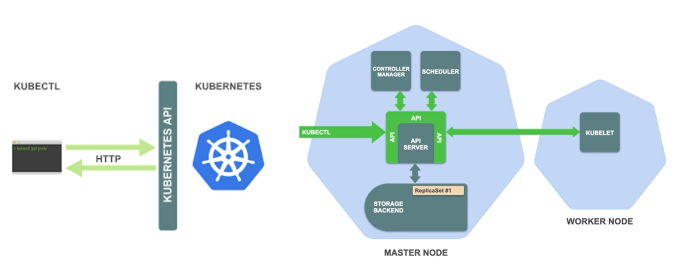

#Ops 
# Kubernetes

쿠버네티스는 클러스터 시스템, 마스터노드와 워커노드가 있고 마스터 노드에는 API 서버가 존재한다. API서버를 통해서 쿠버네티스 클러스터에 명령어를 주고 받을 수 있다.

쿠버네티스 클러스터는 컨테이너 기반의 어플리케이션을 효율적으로 운영할 수 있도록 도와주는 오케스트레이션 시스템

해당 시스템에 올라가는 어플리케이션의 정보를 k8s manifest라는 정보 형태로 관리하게 된다.

기본적으로 kubectl에서 관리할 수 있지만 어플리케이션의 수가 많아지면 불편해지게 된다. 이를 도와주는 것이 kustomize와 helm

### kubectl

[https://kubernetes.io/docs/tasks/tools/install-kubectl-linux/](https://kubernetes.io/docs/tasks/tools/install-kubectl-linux/)

- 쿠버네티스의 API 서버와 통신하여 사용자 명령을 전달할 수 있는 CLI도구

### kustomize

[https://kubectl.docs.kubernetes.io/installation/kustomize/binaries/](https://kubectl.docs.kubernetes.io/installation/kustomize/binaries/)

- 쿠버네티스의 매니페스트 파일을 좀 더 효율적으로 관리할 수 있도록 도와주는 도구

- 기본적인 k8s 매니페스트 파일은 위에처럼 base 와 patch 혹은 overlay가 있다. base에 다른 것들을 patch 하여 하나의 기반파일에 패치파일을 적용하여 여러 환경에 적용할 수 있는 특징을 가지고 있다.

### minikube

쿠버네티스는 굉장히 어려운 기술, 오케스트레이션 시스템으로 컨테이너를 클러스터 레벨에서 효율적으로 관리할 수 있는 클러스터 시스템이다. 여러 머신을 관리하는 시스템, 쿠버네티스를 운영환경 레벨에 맞게 갖추기 위해서는 여러대의 머신 위에서 쿠버네티스 시스템을 구축하게 된다. 학습 수준에서는 효율적이지 않으므로 학습을 위해 손쉽게 쿠버네티스 클러스터를 구현할 수 있는 도구이다.

- 드라이버라는 개념을 통해 다양한 가상환경 드라이버를 제공한다. 가상환경 드라이버를 통해 어떤 드라이버를 통해 클러스터를 구성할지 정할 수 있다.

- 쿠버네티스 버전, 도커 버전 확인 가능
- 쿠버네티스 클러스터에서 사용할 인증서와 키 생성
- 마스터 노드 역할을 하는 control plane 부팅
- 기본적인 RBAC 룰 세팅
- 쿠버네티스 컴포넌트를 올려서 검증후에 마친다.
- kubectl이 쿠버네티스 클러스터와 통신하기 위해서는 설정 파일이 필요하게 된다. 해당 설정 파일은 `~/.kube/config` 파일에 들어가 있다.
    
    
    
    - 클러스터 목록, 컨텍스트 목록, 유저 목록이 있는 것을 확인할 수 있다.
    - 컨텍스트는 인증 리스트라고 봐도 된다. 어떤 클러스터와 통신을 할지 인증과 관련된 설정을 진행한다. 컨텍스트는 클러스터와 유저를 가리키는데, 클러스터에는 접속하게될 클러스터의 정보를 기입하고 유저스에는 인증 사용자 정보로 보면 된다. 컨텍스트에서는 클러스터와 유저 정보를 조합해서 클러스터에 유저정보로 인증을 하겠다 라는 것으로 이해하면된다. 컨텍스트에서는 어떤 클러스터에 어떤 유저로 접근하게되는 지를 정하게 된다.