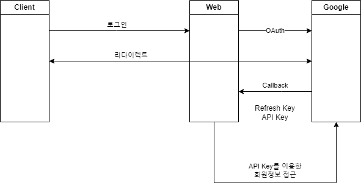

- 개인정보에 대한 중요성이 증대되면서 개인정보를 보호하면서 제대로 관리하는 것이 필요해졌다. 규모가 큰 회사의 경우 이것에 인력과 비용을 투자할 수 있지만 작은 회사의 경우 쉽지 않을 수 있다. 작은회사의 경우 개인정보를 가지지 않고 큰 회사를 통해서 로그인 정보를 가져와서 자신의 회사 DB에 고객의 개인정보를 가지고 있지 않아 이에대한 책임을 가지지 않을 수 있게된다. 
- 고객의 경우도 조그만 사이트를 이용할 때 마다 로그인 정보를 관리하는 것이 귀찮을 수 있다. 따라서 구글이나 네이버, 카카오등의 계정 하나만 관리하기만 하면 되는 편리함을 추구할 수 있다.
- 규모가 큰 회사의 경우에도 자신들의 포털이 최대한 많은 회원을 가지고 있을 필요가 있다. 해당 기능에 자신의 회사를 넣음으로써 자신 회사의 입지를 높일 수 있게 되는 것이다. 
하지만 관리 책임의 문제가 있기 때문에 비용이 발생하게 된다. 큰 회사들의 경우 자신들에게도 어느정도 이익이 있기 때문에 적은 요청량과 민감한 정보가 아닌 경우 공짜로 제공해준다. 

# OAuth의 원리


클라이언트가 우리 웹에 로그인 요청을 하게되면 구글등의 큰 사이트에 OAuth를 요청하게 된다. 그러면 큰 회사가 자신의 회사 로그인 페이지를 리다이렉트하여 클라이언트에게 보여주게 된다. 
처음에 큰 회사에게 로그인이 완료되면 어느 경로로 알려주라는 callback url을 알려주게 된다. 로그인이 완료되면 큰 회사는 해당 경로로 callback을 알려주게 되고 이때 Refresh key 와 API key를 알려주게 된다.
우리는 해당 API key를 사용하여 OAuth를 통해 인가받은 회원 정보에 접근할 수 있게 된다. 이는 무제한적으로 연결되는 것이 아니라 Timeout이 정해져 있고 이때는 refresh key를 이용하여 다시 접근할 수 있게 된다. 
Google, Naver, Kakao 등 OAuth API Key와 Secret을 발급받아야 한다.

## google을 통해 받기
- 먼저 console.developers.google.com 에 접속한다. 
- 프로젝트가 없는 경우 새로운 프로젝트를 만들고 API 및 서비스에 접근하여 OAuth 동의 화면에 접근하여 동의 화면을 만든다.


- 이후에 사용자 인증정보에서 사용자 인증 정보 만들기를 통해 OAuth 2.0 클라이언트 ID를 만든다.


- 발급받은 클라이언트 ID와 Key는 환경변수에 저장한다.

- golang/x/oauth2 와 cloud.google.com/go 를 go get 해줘야 outh2를 사용할 수 있다.

- oauth2.Config 를 작성하여 redirect에 등록한 url과 동일한 url을 넣어주고 요청하는 데이터의 Scope를 지정하고 Endpoint를 넣어준다. 이 Endpoint는 `golang.org/x/oauth2/google` 패키지에 어떤 Endpoint 로 요청해야하는지가 나와있다. 
```go
var googleOuthConfig = oauth2.Config{
	RedirectURL:  "http://localhost:3000/auth/google/callback",
	ClientID:     os.Getenv("GOOGLE_CLIENT_ID"),
	ClientSecret: os.Getenv("GOOGLE_SECRET_KEY"),
	Scopes:       []string{"https://googleapis.com/auth/userinfo.email"},
	Endpoint:     google.Endpoint,
}
```
- 우리는 해당 엔드포인트로 리다이렉트해주면 된다. 이때 AuthCodeURL에는 인자로 state를 넣어줘야하는데 이는 `State is a token to protect the user from CSRF attacks.` 라고 나와있다. CSRF는 url 변조 공격이다. 이는 반드시 비어있지 않은 문자열이어야 하고 로그인이 끝나고 리다이렉트로 콜백이 왔을 때 검증할 수 있어야 한다. 즉 한 번 쓰고 버려지는 키를 만들어줘야 한다. 유저 브라우저 쿠키에 키를 심고 이를 비교하는 방식을 취하도록 한다. 

- 16byte 랜덤한 문자열을 AuthCodeURL에 넣어서 요청을 하게 된다.  그러면 구글 이메일 로그인 페이지를 알려주고 해당 URL로 리다이렉트하여 로그인할 수 있도록 한다. 그 이후 나중에 유저가 로그인이 끝난 뒤에 callback url로 리다이렉트 됐을 때 우리가 저장한 쿠키와 구글에서 알려준 state를 비교해서 같다면 유저가 정상적으로 로그인 한 것이라고 볼 수 있다. 

```go
func googleLoginHandler(w http.ResponseWriter, r *http.Request) {
	state := generateStateOauthCookie(w)
	url := googleOuthConfig.AuthCodeURL(state)
	http.Redirect(w, r, url, http.StatusTemporaryRedirect)
}

func generateStateOauthCookie(w http.ResponseWriter) string {
	expiration := time.Now().Add(1 * 24 * time.Hour)
	b := make([]byte, 16)
	rand.Read(b)
	state := base64.URLEncoding.EncodeToString(b)
	cookie := &http.Cookie{Name: "oauthstate", Value: state, Expires: expiration}
	http.SetCookie(w, cookie)
	return state
}
```

- 쿠키와 state를 비교하여 다를 경우 리다이렉트 해준다. 바로 에러를 보내게되면 해커가 알아채기 쉽기 때문에 바로 에러를 반환하지는 않는다. 

- Exchage를 사용하여 우리가 만든 config를 이용하여 토큰을 받아오는 것을 한다. 멀티 스레드 환경이 아니기 때문에 컨텍스트에 기본 컨텍스트인 background를 넣어준다. 
- 상수로 userinfo를 request 하는 url을 만들어준다. 그리고 그 url에 access_token 값을 넣어주면 구글에서 리턴값으로 userinfo 를 알려주게 된다.
- token struct 의 정보를 보면 AccessToken 과 RefreshToken이 있는데 지금의 경우는 한 번만 접근하는 것으로 refeshtoken은 신경쓰지 않도록 한다. 
```go
func googleAuthCallback(w http.ResponseWriter, r *http.Request) {
	oauthstate, _ := r.Cookie("oauthstate")
	// wrong request
	if r.FormValue("state") != oauthstate.Value {
		log.Printf("invalid google oauth state cookie: %s state: %s\n", oauthstate.Value, r.FormValue("state"))
		http.Redirect(w, r, "/", http.StatusTemporaryRedirect)
	}
	data, err := getGoogleUserInfo(r.FormValue("code"))
	if err != nil {
		log.Println(err.Error())
		http.Redirect(w, r, "/", http.StatusTemporaryRedirect)
		return
	}
	fmt.Fprint(w, string(data))
}
```

```go
func getGoogleUserInfo(code string) ([]byte, error) {
	token, err := googleOuthConfig.Exchange(context.Background(), code)
	if err != nil {
		return nil, fmt.Errorf("faild to exchange %s", err.Error())
	}
	resp, err := http.Get(oauthGoogleUrlAPI + token.AccessToken)
	if err != nil {
		return nil, fmt.Errorf("faild to get UserInfo %s", err.Error())
	}
	data, _ := io.ReadAll(resp.Body)
	return data, nil
}
```

결과로 얻은 id를 db에 user key로 지정하면 된다!


OAuth를 사용하면 작은 사이트를 만들어서 이용하더라도 아이디, 패스워드를 이용하지 않고 id를 key로 사용하여 인덱스로 사용하면 된다. 또한 요청해서 이메일, 친구목록, 프로필 사진 등을 가져올 수 있다. 