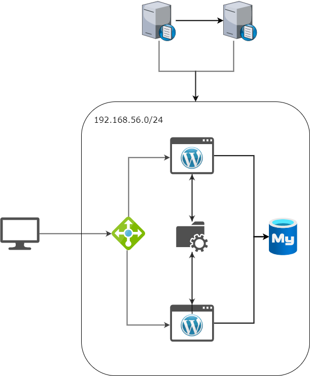

# 웹 서버 구축

전체적인 구성은 이러하다.


웹서버를 이중화하고 워드프레스에 대한 파일 관리는 NFS 서버를 이용해서 이중화한 웹 서버에 모두 적용되게 했다. 그리고 앞에는 로드밸런서를 두어 부하를 분산시키고 뒤에는 DB를 두어 데이터를 관리한다. 내부망에 대한 DNS 서버를 두고 이중화했다.

- OS: CentOS7
- web server: nginx, php, wordpress
- DB: MariaDB
- Load Balancer: nginx
- File share storage: NFS
- DNS: BIND9

## Nginx 설치
[Nginx 설치링크](https://docs.nginx.com/nginx/admin-guide/installing-nginx/installing-nginx-open-source/#installing-prebuilt-rhel-centos-oracle-linux-almalinux-rocky-linux-packages)

위의 방법 보다는 아래 방법이 나은 듯 하다 epel 레포를 사용해서 `yum update`를 진행하면 모든 패키지들이 업데이트되어 시간이 오래걸린다.

```shell
sudo yum install yum-utils
```

그리고 nginx 레포를 만든다.

```shell
sudo vi /etc/yum.repos.d/nginx.repo
```

```fallback
[nginx-stable]
name=nginx stable repo
baseurl=http://nginx.org/packages/centos/$releasever/$basearch/
gpgcheck=1
enabled=1
gpgkey=https://nginx.org/keys/nginx_signing.key
module_hotfixes=true

[nginx-mainline]
name=nginx mainline repo
baseurl=http://nginx.org/packages/mainline/centos/$releasever/$basearch/
gpgcheck=1
enabled=0
gpgkey=https://nginx.org/keys/nginx_signing.key
module_hotfixes=true
```

레포 업데이트 후

```shell
sudo yum-config-manager --enable nginx-stable
```

nginx 설치

```shell
sudo yum install nginx
```

## PHP 설치
프로젝트에 사용한 wordpress는 php 7.4 이상에서 동작하기 때문에 php 7.4를 설치하기 위한 레포를 설정한다.

레포 설정

```bash
sudo wget https://rpms.remirepo.net/enterprise/remi-release-7.rpm
sudo rpm -Uvh remi-release-7.rpm
```

레포 활성화

```bash
sudo yum-config-manager --enable remi-php74
```

php, php-fpm 설치

```bash
sudo yum -y install php php-fpm
```

- nginx상에서 php를 연동하기 위해서 php-fpm을 설치하고 설정을 통해서 이를 연동시켜줘야한다.
	- [php-fpm 연동](https://phsun102.tistory.com/46)

php-fpm 설정 변경

```
sudo vi /etc/php-fpm.d/www.conf

user = nginx 
group = nginx 
listen.owner = nginx 
listen.group = nginx 
listen.mode = 0660

listen = /var/run/php-fpm/php-fpm.sock
```

/etc/nginx/conf.d/default.conf 에서 php에 대해서 주석 처리되어 있는 부분을 해제하고 내용을 수정한다.

```
location ~ \.php$ {
	root /usr/share/nginx/html;
	fastcgi_pass   unix:/var/run/php-fpm/php-fpm.sock;
	fastcgi_index  index.php;
	fastcgi_param  SCRIPT_FILENAME  $document_root$fastcgi_script_name;
	include        fastcgi_params;
}
```

### phpsqlnd 설치
php와 mysql을 연동하기 위해서 php-mysqlnd 를 설치해준다.

```
yum install -y php-mysqlnd
```

서비스 추가하고 방화벽에 포트 추가한다. 혹은 기본으로 80포트가 열리기 때문에 add-service=http 로 해도 된다.
```
[root@localhost ~]# systemctl restart nginx
[root@localhost ~]# systemctl enable nginx
Created symlink from /etc/systemd/system/multi-user.target.wants/nginx.service to /usr/lib/systemd/system/nginx.service.
[root@localhost ~]# firewall-cmd --add-port=80/tcp --permanent
success
[root@localhost ~]# firewall-cmd --reload
success
```


### Nginx 설정
nginx 설정 파일은 `/etc/nginx/nginx.conf` 이다. nginx 설정을 할 수 있다.
기본적인 http의 설정에서 root는 어디인지 어떤 포트를 사용하는지 등의 내용을 확인할 수 있다.
```
server {
    listen       80;
    server_name  hahajong.store;
    root /mnt/web/wordpress;
    index index.php index.html index.htm;

    location / {
	try_files $uri $uri/ /index.php?$args;
    }

    location ~ \.php$ {
	fastcgi_pass   unix:/var/run/php-fpm/php-fpm.sock;
        fastcgi_index  index.php;
        fastcgi_param  SCRIPT_FILENAME  $document_root$fastcgi_script_name;
        include        fastcgi_params;
    }
    
}
```
- 웹 서버에서는 `/usr/share/nginx/html/index.html` 을 각 웹 서버에 맞게 바꾼다.
- 로드밸런서에서는 conf에 `upstream` 으로 서버 그룹을 설정하고 `proxy_pass` 로 해당 그룹을 지정한다. 이것으로 http 요청에 대해서 해당 서버 그룹으로 요청을 보낼 수 있도록 한다. [로드밸런싱 설정](https://docs.nginx.com/nginx/admin-guide/load-balancer/http-load-balancer/)

## NFS

### 서버 설정

```
[root@storage ~]# yum -y install nfs-utils

[root@storage ~]# mkdir /share
[root@storage ~]# chmod 777 /share/ 
[root@storage ~]# vi /etc/exports 
[root@storage ~]# cat /etc/exports 
/share	192.168.56.*(rw,sync,no_root_squash)

[root@storage ~]# systemctl restart nfs-server
[root@storage ~]# systemctl enable nfs-server

[root@storage ~]# firewall-cmd --add-service=nfs --permanent
[root@storage ~]# firewall-cmd --reload
```

### 클라이언트 설정

```
[root@web1 ~]# mkdir -p /mnt/web
[root@web1 ~]# cat /etc/fstab 
192.168.56.31:/share	/mnt/web	nfs	rw,sync	0 0 
[root@web1 ~]# mount -a
```

## DB 설치

```
yum -y install mariadb-server
[root@db ~]# systemctl restart mariadb
[root@db ~]# systemctl enable mariadb
[root@db ~]# mysql_secure_installation 
[root@db ~]# firewall-cmd --add-service=mysql --permanent
success
[root@db ~]# firewall-cmd --reload
```

DB 설치 후 mysql_secure_installation 으로 최초 보안 설정을 해준다.

wordpress 를 위한 db 계정 생성

```
[root@db ~]# mysql -u root -p
Enter password: 
Welcome to the MariaDB monitor.  Commands end with ; or \g.
Your MariaDB connection id is 11
Server version: 5.5.68-MariaDB MariaDB Server

Copyright (c) 2000, 2018, Oracle, MariaDB Corporation Ab and others.

Type 'help;' or '\h' for help. Type '\c' to clear the current input statement.

MariaDB [(none)]> GRANT ALL ON wordpress.* TO wordpress@'192.168.56.%' IDENTIFIED BY '1234';  
Query OK, 0 rows affected (0.00 sec)
```
## wordpress 설치

```
tar xzvf wordpress-6.1.1.tar.gz -C /share/
```

```
[root@web1 ~]# chown -R nginx:nginx /mnt/web/wordpress/
```

- [서브 디렉토리로 배포하는 경우 유의해야할 점](https://stackoverflow.com/questions/19285355/nginx-403-error-directory-index-of-folder-is-forbidden)
- seliux 상 문제가 있는 듯 하다. 
	- [selinux 에러 예시1](https://svrforum.com/svr/105716)
	- [selinux 에러 예시2](https://hbesthee.tistory.com/1635)
	- [wordpress 에러 로그 출력 설정](https://zzznara2.tistory.com/706)

### 이중화 관련
파일 업로드 후에 웹 서버와 DB를 확인해보니 특정 서버에만 파일이 저장되고 DB는 해당 서버의 파일을 가리키고 있다. 해당 페이지는 결국 부하 분산이 안될 것이다. 부하 분산이 가능하게 이중화 하는 것에 대해서 고민을 해봐야 할 것 같다.

## DNS
설치시에 도메인으로 접근해서 설치해야 외부에서 접근해도 내용을 깨지지 않고 볼 수 있다.
### bind 설치 및 구성(마스터)
```
yum -y install bind
```

```
vi /etc/named.conf

...

options {
        listen-on port 53 { any; };
        listen-on-v6 port 53 { none; };
        directory       "/var/named";
        dump-file       "/var/named/data/cache_dump.db";
        statistics-file "/var/named/data/named_stats.txt";
        memstatistics-file "/var/named/data/named_mem_stats.txt";
        recursing-file  "/var/named/data/named.recursing";
        secroots-file   "/var/named/data/named.secroots";
        allow-query     { any; };

...

zone "hahajong.store" IN {
	type master;
	file "hahajong.store";
	also-notify { 192.168.56.42; };
};

...
```


zone file 생성 및 /etc/name.conf 에서 zone 추가

```
[root@dns1 named]# cat hahajong.store 
$TTL 3H
@	IN SOA	hahajong.store root. (
					1	; serial
					1D	; refresh
					1H	; retry
					1W	; expire
					3H )	; minimum
	IN	NS	ns1.hahajong.store.
	IN	NS	ns2.hahajong.store.
	IN	A	192.168.56.11
	IN	A	192.168.56.12
ns1	IN	A	192.168.56.41
ns2	IN	A	192.168.56.42
www	IN	CNAME	hahajong.store.
db	IN	A	192.168.56.21
```

named 서비스 시작 및 방화벽 추가 selinux disable
```
[root@dns1 named]# systemctl restart named
[root@dns1 named]# systemctl enable named
Created symlink from /etc/systemd/system/multi-user.target.wants/named.service to /usr/lib/systemd/system/named.service.
[root@dns1 named]# firewall-cmd --add-service=dns --permanent
success
[root@dns1 named]# firewall-cmd --reload
success
```


### 슬레이브 설정

설치 및 초기 설정, 방화벽 추가 동일하게 진행한다.

```
cat /etc/named.conf

...
zone "hahajong.store" IN {
	type slave;
	masters { 192.168.56.41; };
	file "slaves/hahajong.store.slave";
};
...
```

시스템 재시작


# 포트포워딩
VirtualBox에서 NAT Network를 사용하는 경우 Network Manger에서 해당 네트워크를 찾아서 포트포워딩 해줘야 한다.

# Linux에서 DNS 서버 설정
nmcli로 dns 서버 설정 시 modify로 설정하면 그냥 dns서버가 추가 되는 것이지 변경되는 것이 아니다. /etc/resolv.conf 에는 3개의 dns 서버만 인식하기 때문에 자동으로 생성되는 dns 서버를 없애주려면 `nmcli device modify [name] ipv4.ignore-auto-dns yes` 명령어를 사용해줘야 한다.
